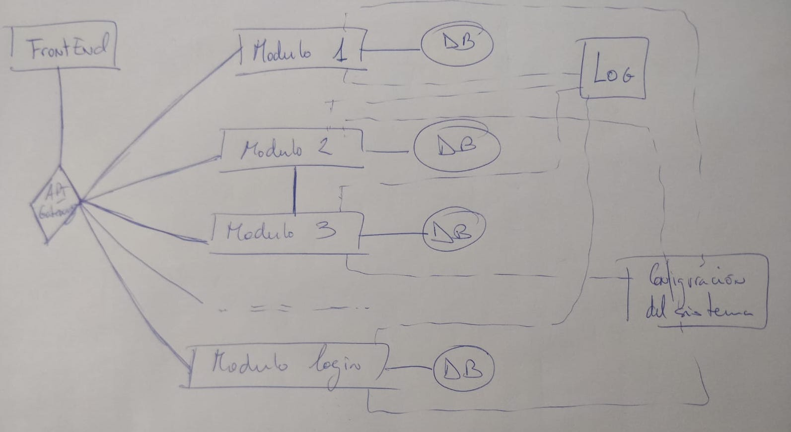

# Proyecto a desarrollar

La idea base del proyecto es unificar tanto la construcción de un proyecto para gestionar todos los aspectos posibles de una funeraria, junto con el manejo y provisión de la arquitectura hardware necesaria haciendo uso de la infraestructura como código. Por tanto, desde un desarrollo ágil se irá avanzando en el desarrollo de ambos aspectos hasta llegar a un trabajo completamente útil.

# Arquitectura

Para el proyecto vamos a hacer uso de una arquitectura basada en microservicios. Ahora mismo con el siguiente diagrama tan solo intento definir una imagen mental con la que plasmar como concibo la arquitectura.

Inicialmente pienso en los siguientes módulos: 
- Gestión de defunciones: que comprenderá todos los datos asociados al difunto. 
- Gestión documental: en este trataremos cualquier tipo de documento que se pueda general respecto al servicio. Si tenemos varios documentos distintos, la generación de cada uno podría ser un microservicio distinto.
- Gestión de contabilidad: encargado del control de la facturación de cada servicio. Este módulo será el que se desarrolle en mayor o menor medidad en función del tiempo disponible.
- Agenda: gestión de un calendario, en el que incluir eventos, notificaciones, ....
- Correo: sistema de correo para poder enviar lo que se necesite.
- Informes, alertas y gráficos: útil para la generación de distintos informes o el envío de alertas. También podrían ser microservicios independientes.

Con esta pequeña descripción intento mostrar la idea inicial que tengo sobre cada módulo, aunque de una forma muy informal.

# Herramientas

Esto tan solo es una sugerencia inicial ya que aún tengo que analizar para cada una de estas las diferentes opciones que podemos encontrar, y cuales se adapatarían mejor a nuestras necesidades. Pero inicialmente mi intención es usar lo siguiente.

## Desarrollo

- Front End: React, básicamente porque quiero aprenderlo.
- Backend:
	Para el api gateway creo que las posibilidades son nginx o krakend y tendría que ver cual poder usar.
	Luego cada módulo podría ser implementado en un lenguaje distinto sin problema. Inicialmente tenía la idea de hacer cada api de cada módulo en Nodejs y luego hacer la funcionalidad de cada módulo en el lenguaje que decidiera. Pensaba esto ya que tenía la idea de comunicar cada api con su funcionalidad (modelo) o cualquier otro mediante RabbitMQ. ¿Esto no es posible verdad? Investigando durante estos días he llegado a la conclusion de que eso no es posible, o no es la forma correcta de desarrollar.

	Por tanto supongo que cada módulo (API + Modelo) debe ir en un mismo lenguaje, aunque dos módulos usen lenguajes distintos. Por esta razón ya en el diagrama no he especificado nada sobre RabbitMQ ya que no sabría bien donde usarlo, ¿quizás en la comunicación entre módulos? ¿en la comunicación entre el api gateway y la api de cada módulo? No tengo muy claro como sería lo correcto o si realmente es útil rabbitmq en estos casos. Supongo que la comunicación entre módulos se realiza mediante HTTP haciendo una petición del módulo deseado, quizás sea aqui donde usar rabbit? obtendríamos ventajas o solo complejidad en el desarrollo? Quizás este sea uno de los puntos más importantes ahora mismo donde necesito ayuda / investigación.

	Quizás el lenguaje elegido para el backend sea Python o Nodejs. El primero básicamente es porque estoy trabajando con él y me gustaría llegar a un mejor nivel, el segundo inicialmente es porque conozco muchas de sus bondades y me gustaría aprenderlo.

## Despligue

En cuanto al despligue, provisión, orquestación y demás me gustaría seguir el camino marcado durante la asigntura. Ansible, vagrant, azure... Aún tengo que pensar bien sobre esto pero alguna sugerencia por su parte sería genial.

# Planificacion

El tiempo estimado para realizar el proyecto debe ser unas 300 horas en principio.

- Mes 1 (Marzo) 80 horas: 
	- Estructura básica front + back.
		- Módulo login.			
	- Documentación relacionada con los requisitos.

- Mes 2 (Abril) 80 horas:
	- Gestor de defunciones.
	- Provision de los modulos actuales.
	- Orquestación de los modulos actuales.
	- Despliegue en servicio Cloud.
	- Documentación.

- Mes 3 (Mayo) 80 horas:
	- Gestor documental.
	- Agenda.
	- Informes / Alertas / Gráficos.
	- Ampliar provisión + orquestación a los nuevos módulos.
	- Documentación.

- Mes 4 (Junio) 80 horas:
	- Gestor contabilidad.
	- Correo.
	- Documentación.
