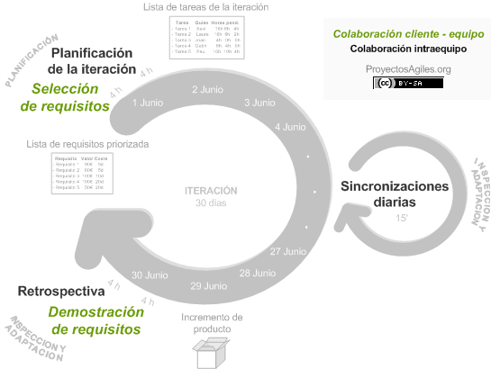

# Análisis del sistema

Comenzamos a adentrarnos en las cuestiones importantes del proyecto que nos ocupa, exponiendo en este capítulo el análisis completo que hemos seguido para la realización del sistema. Comenzaremos con la planificación inicialmente ideada, continuaremos con los presupuestos calculados y culminaremos con las diferentes historias de usuario definidas.

## Planificación

Podríamos afirmar que una correcta planificación puede suponer el éxito en gran medida de un proyecto en cualquier disciplina aplicable. Si nos centramos en la idea de ingeniería, la planificación tiene tal importancia que ha generado multitud de modelos que son usados por todos los profesionales que se dedican al desarrollo de software. La necesidad de una correcta planificación de cara a un proyecto que durará meses, o incluso algún año, es crucial para marcar la línea a seguir.

Posteriormente realizaremos una estimación tanto de recursos como temporal con el coste asociado a su desarrollo, introduciremos los distintos modos de desarrollo de software disponibles, haciendo especial hincapié en el que hemos utilizado nosotros. Terminaremos con un análisis completo de las historias de usuario necesarias para la realización del sistema de información.

### Estimación de recursos necesarios para el desarrollo

Primeramente, abordaremos los distintos recursos utilizados, siendo estos tanto de personal como de hardware y de software.

- Personal: El coste del proyecto en cuanto a personal se centra en una sola persona, Luis Gallego Quero, el cual ha sido el encargado de la materialización de la aplicación.
- Hardware: Los componentes de la máquina utilizada son los siguientes:
	- Procesador: Intel Core i7 de seis núcleos a 2,6 GHz de novena generación.
	- Tarjeta gráfica: AMD Radeon Pro 5300M con 4 GB de memoria GDDR6.
	- Memoria Ram: 16 GB de memoria DDR4 a 2.666 MHz.
	- Disco duro: 512 GB de almacenamiento SSD.
- Software: Aplicaciones que hemos usado durante el desarrollo.
	- [WebStorm](https://www.jetbrains.com/webstorm/): IDE especializado en JavaScript, nos proporciona gran cantidad de herramientas y facilidades para que el proceso de desarrollo sea cómodo e intuitivo. Además tiene una buena integración con *Github* o Docker entre otros, lo que lo convierte en una herramientas de trabajo imprescindible para cualquier desarrollador.
	- [Robo3T](https://robomongo.org/): Aplicación opensource que nos permite manejar nuestra base de datos mongodb de forma intuitiva. Ha sido especialmente útil para conectar y visualizar nuestra base de datos local.
	- [Toggl](https://toggl.com/): Herramienta sencilla y útil enfocada al rastreo del tiempo de trabajo. Por tanto ha sido utilizada para controlar de forma exhaustiva el tiempo empleado durante el desarrollo del TFM.
	- [Chrome](https://www.google.com/intl/es/chrome/): Navegador web que hemos usado tanto para el uso de *Github* como para algunos tests a nuestra aplicación. 
	- [Texmaker](https://www.xm1math.net/texmaker/): Editor para documentos en Latex.
	- [Telegram](https://telegram.org/): Herramienta de comunicación usada principalmente para nuestra interacción con el tutor. Además disponíamos de un *bot* que notificaba de cada suceso que ocurría en nuestro repositorio de *Github*.

### Metodología de desarrollo

Las metodologías de desarrollo se centran principalmente en hacer uso de diversas herramientas, técnicas, métodos y modelos para la ejecución correcta de los procesos que conlleva el proyecto. Concretamente [Sommerville](https://books.google.es/books?hl=es&lr=&id=gQWd49zSut4C&oi=fnd&pg=PR14&dq=Ian+Sommerville.+Ingenier%C3%ADa+del+Software,+9a+Edici%C3%B3n&ots=s775xtrBvi&sig=gYSUgO0IotekleX-1ppRObgta9U#v=onepage&q=Ian%20Sommerville.%20Ingenier%C3%ADa%20del%20Software%2C%209a%20Edici%C3%B3n&f=false) define el proceso de software como "una representación, simplificada de un proceso de software, representada desde una perspectiva específica. Por su naturaleza los modelos son simplificados, por lo tanto, un modelo de procesos del software es una abstracción de un proceso real".

Actualmente disponemos de una gran cantidad de modelos y metodologías para el desarrollo de software. Durante muchos años se han estudiado y elaborado diferentes propuestas que buscan hacer más eficiente y efectivo el desarrollo de un proyecto, por lo que hoy en día disfrutamos la oportunidad de elegir el que más se adapte a nuestras necesidades.

Los más destacados son los siguientes que expondremos, de los cuales podemos encontrar una amplia bibliografía.

#### Tipos de metodologías de desarrollo

##### Metodología en cascada: 

Comenzamos por una de las metodologías más antiguas, ya que derivó de otros procesos de ingeniería no relacionados con la informática. Metodología lineal, consta de distintas fases que hay que completar para poder avanzar a la siguiente. Está compuesta por las siguientes fases:

- Análisis de requisitos.
- Diseño
- Implementación y desarrollo. 
- Integración
- Pruebas o validación.
- Mantenimiento

Como podemos ver, es una metodología lineal, en la que, si no se completa cada una de las fases en su totalidad, no es posible avanzar a la siguiente.

##### Modelo en espiral: 

Principalmente va dirigido hacia el análisis de riesgos. Consiste en realizar varias iteraciones, pasando por cada una de sus fases una y otra vez. A diferencia del anterior, que no tiene vuelta atrás, se pueden hacer las iteraciones que se consideren necesarias. Sus fases principales son las siguientes:

- Determinación de objetivos. 
- Análisis de riesgos. 
- Desarrollo y pruebas.
- Planificación.

##### Metodología de prototipo: 

Este modelo es básicamente prueba y error, ya que nos da la posibilidad de desarrollar prototipos desechables que se refinarán hasta obtener el producto deseado. 

Una de las principales ventajas es que la retroalimentación a los usuarios se proporciona desde etapas muy tempranas, así ellos participan en todo momento en el desarrollo del proyecto.

Si bien podríamos estar definiendo diferentes metodologías y variantes de este tipo durante mucho más tiempo, vamos a terminar centrándonos en dos que actualmente están cobrando especial relevancia.

Denominadas metodologías ágiles de desarrollo, nacieron tratando de dar una respuesta a las necesidades de proyectos cada vez más cambiantes y dinámicos. Por lo tanto, no es más que una metodología adaptativa, que te permite llevar a cabo proyectos de desarrollo de software adaptándote a los cambios que llegan y evolucionando de forma conjunta con el software. De este modo podemos encontrar dos de especial relevancia:

##### Metodología Scrum: 

Basada en la idea de minimizar los riesgos durante la realización de un proyecto de forma colaborativa. Encontramos distintas ventajas como la productividad, la calidad y el seguimiento diario de los avances del proyecto, logrando así que los integrantes estén unidos, comunicados y que el cliente este informado de los avances.

Podríamos decir que *Scrum* es un proceso en el que se aplican de manera regular un conjunto de buenas prácticas para trabajar en equipo, y obtener el mejor resultado posible de un proyecto. Estas prácticas se apoyan unas a otras y su selección tiene origen en un estudio de la manera de trabajar de equipos altamente productivos.

En *Scrum* se realizan entregas parciales y regulares del producto final, priorizadas por el beneficio que aportan al receptor del proyecto. Por ello, *Scrum* está especialmente indicado para proyectos en entornos complejos, donde se necesita obtener resultados pronto, donde los requisitos son cambiantes o poco definidos, donde la innovación, la competitividad, la flexibilidad y la productividad son fundamentales. [Fuente](https://proyectosagiles.org/que-es-scrum/)

##### ProgramaciónExtrema:

Metodología de desarrollo ágil que tiene como principal objetivo aumentar la productividad a la hora de desarrollar un proyecto software. Da prioridad a los trabajos que dan un resultado directo y en los cuales se reduce la burocracia que pueda existir en el entorno de trabajo. Dentro de sus principios podemos encontrar:

- Retroalimentación.
- Proceso continuo en lugar de por bloques. 
- Propiedad intelectual compartida.
- Entendimiento compartido.

Después de valorar las distintas metodologías de desarrollo, nos hemos decantado para la realización de nuestro proyecto por *Scrum*. La razón ha sido bastante básica, nos enfrentamos a un trabajo con unos requisitos definidos, pero no tenemos dudas de que estos pueden cambiar (ampliándose y reduciéndose) a lo largo de su desarrollo, o más concretamente, surgirán nuevas posibilidades para acometerlos de maneras más efectivas, fruto de la experiencia tomada a lo largo del proceso de desarrollo.

También la metodología *Scrum* es relevante para nuestro proceso de desarrollo ya que nos permite desde tiempos tempranos establecer una base completa de nuestro proyecto, con cada una de las tecnologías y herramientas funcionando desde casos base. Y por tanto, construir el trabajo planificado de forma uniforme, consiguiendo de esta manera entregar funcionalidad tanto operativa como completamente testeada.

Por tanto, mediante esta metodología, una vez definido el proyecto, se seguirá un proceso iterativo que nos ayude a controlar, desarrollar y mejorar nuestra idea inicial.

[Otra Fuente](https://www.megapractical.com/blog-de-arquitectura-soa-y-desarrollo-de-software/metodologias-de-desarrollo-de-software)

### Metodología *Scrum*

Antes de adentrarnos en los detalles de la planificación temporal marcada para los próximos meses, afirmar que el desarrollo estará guiado por la metodología *Scrum*. Por tanto, es conveniente indagar un poco más en los detalles de dicha metodología.

Podríamos decir que *Scrum* es un proceso en el que se aplican de manera regular un conjunto de buenas prácticas para trabajar en equipo, y obtener el mejor resultado posible de un proyecto. Estas prácticas se apoyan unas a otras, y su selección tiene origen en un estudio enfocado en la organización del trabajo de equipos altamente productivos.

En *Scrum* se realizan entregas parciales y regulares del producto final, priorizadas por el beneficio que aportan al receptor del proyecto. Por ello, *Scrum* está especialmente indicado para proyectos en entornos complejos, donde se necesita obtener resultados pronto, donde los requisitos son cambiantes o poco definidos, donde la innovación, la competitividad, la flexibilidad y la productividad son fundamentales. 

#### Proceso

En *Scrum* un proyecto se ejecuta en ciclos temporales cortos y de duración fija (iteraciones que normalmente son de 2 semanas, aunque en algunos equipos son de 3 y hasta 4 semanas, límite máximo de *feedback* de producto real y reflexión). Cada iteración tiene que proporcionar un resultado completo, un incremento de producto final que sea susceptible de ser entregado con el mínimo esfuerzo al cliente cuando lo solicite.

Hay que tener en cuenta que es el cliente el que selecciona cuales son los objetivos prioritarios para el siguiente *sprint* en función del valor que aportan respecto al coste. 

#### Planificación de la iteración:

Se suele realizar el primer día de la iteración y tiene dos partes:

- Selección de requisitos: El cliente presenta al equipo la lista de requisitos priorizada del producto o proyecto. El equipo pregunta al cliente las dudas que surgen y selecciona los requisitos más prioritarios que prevé que podrá completar en la iteración, de manera que puedan ser entregados si el cliente lo solicita.
- Planificación de la iteración: El equipo elabora la lista de tareas de la iteración necesarias para desarrollar los requisitos seleccionados. La estimación de esfuerzo se hace de manera conjunta y los miembros del equipo se auto-asignan las tareas.

#### Ejecución de la iteración

Diariamente cada equipo realiza una reunión de sincronización/actualización en la cual el equipo inspecciona el trabajo que el resto está realizando, para así poder hacer las adaptaciones necesarias que permitan cumplir con la previsión de objetivos a mostrar al final de la iteración.

Durante la iteración, el cliente junto con el equipo refinan la lista de requisitos (para prepararlos para las siguientes iteraciones) y, si es necesario, cambian o re-planifican los objetivos del proyecto con el objetivo de maximizar la utilidad de lo que se desarrolla y el retorno de inversión.

#### Inspección y adaptación

El último día de la iteración se realiza la reunión de revisión del *sprint*. Tiene dos partes:

- Revisión (demostración): El equipo presenta al cliente los requisitos completados en la iteración, en forma de incremento de producto preparado para ser entregado con el mínimo esfuerzo. En función de los resultados mostrados y de los cambios que haya habido en el contexto del proyecto, el cliente realiza las adaptaciones necesarias de manera objetiva, ya desde la primera iteración, re-planificando el proyecto.

- Retrospectiva: El equipo analiza cómo ha sido su manera de trabajar y cuáles son los problemas que podrían impedirle progresar adecuadamente, mejorando de manera continua su productividad. 

#### Conclusión

A grandes rasgos estos son los principios y las pautas que rigen a la metodología *Scrum*. Como podemos ver, en líneas generales está enfocada a la entrega rápida de nuevo material útil y funcional al cliente, además de integrar al cliente en el proceso de desarrollo y orientarlo como una parte importante de este. Añadir también que la metodología está especialmente enfocada a trabajo en equipo, pero en nuestro caso el desarrollo es individual por lo que nos centraremos en obtener los beneficios que nos proporcionaría la entrega periódica de funcionalidad.

Por tanto, en nuestro caso usaremos los principios básicos de la metodología *Scrum* pero orientada al caso de un solo usuario en el proyecto, que a la vez es tanto cliente, como desarrollador.

- [Fuente_1](https://proyectosagiles.org/que-es-scrum/)
- [Fuente_2](https://proyectosagiles.org/como-funciona-scrum/)

### Estimación temporal

No cabe duda que parte del éxito de un proyecto recae en la correcta organización del trabajo que se desarrollará, de cuando se desarrollará y del tiempo que ocupara. Es por ello que esta sección se vuelve especialmente relevante ya que, una vez más, hemos caído en el optimismo. 

En los próximos apartados presentaremos la planificación inicial que se marco para el presente proyecto e intentaremos finalizar este punto con algunas conclusiones que nos permitan entender el grado de éxito, o no, alcanzando durante estos meses. 

Como aspectos iniciales comentar que definimos una planificación con la que poder afrontar progresivamente cada una de las historias de usuario que podrá encontrar en el siguiente punto. Por tanto, definimos los siguientes *sprints*, que tendrán una duración cada uno de 4 semanas aproximadamente, para los que se dedicarán unas 80 horas en cada uno dando lugar a temporización final de unas 300 horas. 

Culminar esta introducción añadiendo que aunque ahora presentamos los *sprints* a alto nivel, es decir, mediante ideas generales de lo que buscábamos conseguir, el proceso de desarrollo ha estado marcado por las historias de usuario relativas a cada meta que establecemos en dichos *sprints*. Y por tanto, marcada por *milestones* en los que entregar el trabajo realizado. Si bien, todo lo relativo a los *milestones* lo veremos en más detalle cuando hablemos especialmente de las herramientas y *Github*. Sin más, presentamos los *sprints*.

#### Sprint 1 - Marzo

La primera iteración de nuestro proyecto estará marcada especialmente por la documentación tanto de los requisitos como de la investigación de los diferentes lenguajes y herramientas que usaremos en el desarrollo. También nos enfocaremos en crear el primer microservicio del proyecto. Concretamente las competencias de este *sprint* son las siguientes:

- Investigación y documentación sobre los microservicios.
- Investigación y documentación de las distintas herramientas a usar, tanto para el desarrollo del software como de la infraestructura.
- Documentación sobre todo lo relacionado con la especificación de requisitos, enfocado especialmente en las historias de usuarios.
- Configuración de la herramienta para la integración continua de nuestro proyecto con *git*.
- Trabajar en el primer microservicio.

#### Sprint 2 - Abril

Una vez que tengamos todo lo relacionado con los requisitos y herramientas de nuestro proyecto correctamente investigado, documentado y elegido, además de una primera base funcional, es el momento de adentrarnos plenamente en el desarrollo de este. Es por ello que en esta iteración nos centraremos en analizar los datos principales que requiere nuestro sistema, para posteriormente poder construirlos en los microservicios correspondientes. Además trabajaremos en el segundo microservicio y eje principal del proyecto.

- Análisis de los diferentes datos que usaremos en nuestro sistema.
- Microservicios para el gestor de defunciones.
- Documentación.

#### Sprint 3 - Mayo

Una vez que todo nuestro proyecto tenga una base solida, nos centraremos en seguir construyendo este proporcionalmente aunque principalmente centrados en el desarrollo de nuevos microservicios. Si bien llegados a este punto deberemos enfocarnos en dos puntos importantes también, en trabajar tanto la orquestación, provisión y despliegue de los microservicios como la parte visual de este, es decir, *el frontend*. 

- Microservicios para manejar los datos del cliente y familiares.
- *Frontend* para el *login* y las defunciones.
- Provisión, orquestación y despliegue del primer microservicio.
- Documentación.

#### Sprint 4 - Junio

Sprint final en el que nos enfocaremos en culminar los detalles, y que estará marcado tanto por el desarrollo de la infraestructura como código de los microservicios restantes como los aspectos visuales de estos. También la documentación final, enfocada a las conclusiones de estos últimos meses, y la preparación de la presentación serán puntos a tener en cuenta. Si finalmente dispusiéramos de tiempo restante, podríamos dedicarlo a la realización del gestor de contabilidad, agenda o correo. Las competencias del *sprint* final son las siguientes:

- Orquestación, provisión y despliegue de los microservicios restantes.
- *Frontend* enfocado a la visualización de los documentos finales.
- Documentación final.
- Presentación.

#### Conclusión

Como podemos ver, y ya adelantábamos, inicialmente el *frontend* era parte de nuestro proyecto, pero los sobrecostes en cuanto a tiempo que nos hemos encontrado por el camino especialmente para la realización de los microservicios lo ha imposibilitado.

¿Porqué ocurre esto? Desde mi punto de vista afirmaría que en gran medida ocurre debido al nivel de conocimiento que se posea sobre las herramientas y lenguajes utilizados. En nuestro caso, indagar y utilizar microservicios ha sido toda una nueva experiencia que nos ha obligado a cambiar nuestra forma de enfocar cada parte del software que construimos. Eso requiere tiempo.

Además, en nuestro afán por aprender nuevos lenguajes que sean tanto potentes como modernos, y además útiles en el proyecto que nos ocupe, como se verá más adelante nos decantamos por usar *Node.js*. Por tanto, el tiempo que se requiere para aprender y poder aprovechar todas las ventajas que nos aporta el lenguaje de nuevo requiere tiempo.

Podemos concluir diciendo que en gran medida, en nuestro caso, el no poder culminar dentro del tiempo marcado todo el proyecto ideado, se basa totalmente en el tiempo requerido para aprender, el cual no se ha tenido en cuenta a la hora de elaborar dicha planificación.

## Presupuesto

Pensando en la situación hipotética de que el proyecto que nos ocupa tuviera que desarrollarse por una empresa, encontraríamos diferentes roles. Por un lado, tendríamos al cliente concreto, el cual nos presentaría los diferentes requisitos del proyecto y de la funcionalidad final a conseguir. Dicho rol se enmarcaría en la figura del tutor. Por otro lado, respecto al personal encargado de su realización, nos encontramos con su autor, Luis Gallego Quero, que ocupa el papel de ingeniero informático. En base a esto último podemos definir los siguientes costes:

- Costes personal: Ingeniero informático => 300 horas x 25€/hora = 7500€
- Costes hardware: MacBook Pro.
	- Precio: 2800€
	- Periodo amortización: 2 años.
	- Duración proyecto: 4 meses
	- Total = 467€

En resumen, el coste del proyecto asciende hasta los 7967€.

## Análisis. Especificación de requisitos.

### Propósito

### Ámbito del sistema

### Descripción general

#### Perspectiva del producto

#### Funciones del producto (módulos)

#### Requisitos futuros

### Historias de usuario

Podemos entender las historias de usuario como una manera simple de describir una tarea, la cual aporta valor al usuario que hace uso de la aplicación. Para ello hacemos uso del lenguaje común del usuario, coloquial, y con tan solo un par de frases queda definido el requisito.

Esta forma de representar a los requisitos está directamente ligada a los casos de uso, y en gran parte los sustituye. Esto se debe a que las historias de usuarios son más simples de escribir y de entender, además nos aseguran que no hay cabos sueltos.

Finalmente están especialmente relacionadas con el desarrollo ágil. Las historias de usuarios están vivas. Cuando se realizan las planificaciones para los sprint son fácilmente desglosables, priorizadas y organizadas en diferentes tareas, listas para ser repartidas a los diferentes equipos. Ideal para metodologías como *Scrum*.

- La estructura que siguen es la siguiente:
	- Yo como "usuario"
	- necesito / deseo / quiero "funcionalidad"
	- para "beneficio de negocio"

- HU. 1 - Sistema
	- Usuario: Jefe / Empleado
	- Funcionalidad: *Login* en el sistema.
	- Resultado: Nos permitirá verificar que los datos del usuario introducidos son correctos. También nos permitirá manejar la información de los usuarios (creación - lectura - actualización - borrado).
	- Criterios de aceptación:
		- Se aceptará como nombre de usuario tanto el correo como el nombre.
		- La contraseña asociada tiene que ser correcta.
		- La contraseña tendrá más de 8 carácteres.
		- La contraseña se almacenará bajo encriptación.
		- Se proporcionarán varios métodos de login o al menos el sistema estará preparado para su inclusión rápida.
		- Se debe posibilitar el uso de JWT si fuera necesario.
		- El nombre del usuario y su correo deberán ser únicos.
		- Al menos podremos loguearnos mediante usuario y contraseña.
		- Debemos poder tener diferentes roles.

- HU. 2 - Sistema
	- Usuario: Jefe / Empleado
	- Funcionalidad: Crear, leer, actualizar y borrar una defunción (servicio funerario).
	- Resultado: El sistema añadirá, leerá, actualizará o borrará los datos de la defunción en el sistema. 
	- Criterios de aceptación:
		- Se tiene que permitir tanto añadir una nueva defunción como leer, actualizar y borrar este.
		- La defunción comprenderá los datos tanto de difunto (nombre, DNI, etc) como del servicio en sí (fecha del servicio, lugar, fecha de la misa, etc).
		- Debemos poder obtener la información de todas las defunciones almacenadas en la base de datos.
		- Debemos poder tener referencias a su cliente, familiares y facturas asociados.
		- Debemos poder tener información de historial de cambios, como fecha de creación, fecha de edición, usuario creador y actualizador en principio.
		- Solo un usuario con rol de administrador podrá borrar una defunción.

- HU. 3 - Sistema
	- Usuario: Jefe / Empleado
	- Funcionalidad: Crear, leer, actualizar y borrar los datos relativos a un cliente.
	- Resultado: El sistema añadirá, leerá, actualizará o borrará los datos del cliente en el sistema. 
	- Criterios de aceptación:
		- Se tiene que permitir tanto añadir un nuevo cliente como leer, actualizar y borrar este.
		- Un cliente no tiene porqué estar ligado inicialmente a una defunción.
		- El sistema debe permitir asociar el cliente al difunto posteriormente.
		- Un cliente debe poder asociarse a varios defunciones. 
		- Los datos que manejaremos relativos al cliente están especialmente ligados a la posterior facturación de la defunción, por lo que la posibilidad de almacenar datos como cuentas bancarias serán de especial interés.
		- Debemos poder tener información de historial de cambios, como fecha de creación, fecha de edición, usuario creador y actualizador en principio.
		- Solo un usuario con rol de administrador podrá borrar un cliente.

- HU. 4 - Sistema
	- Usuario: Jefe / Empleado
	- Funcionalidad: Crear, leer, actualizar y borrar los datos relativos a familiares.
	- Resultado: El sistema añadirá, leerá, actualizará o borrará los datos del cliente en el sistema. 
	- Criterios de aceptación:		
		- Se tiene que permitir tanto añadir los datos de familiares como leer, actualizar y borrar estos.
		- Familiares es una sola entidad que tiene información relativa a los familiares del difunto. Está especialmente ligado a los datos que aparecerán en los documentos (esquela y misa). 
		- Tiene que estar siempre ligada a una defunción.
		- La estructura que se utilice para su almacenamiento debe ser óptima para su posterior uso en documentos.
		- Debemos poder tener información de historial de cambios, como fecha de creación, fecha de edición, usuario creador y actualizador en principio.
		- Solo un usuario con rol de administrador podrá borrar un familiar.	

- HU. 5 - Sistema
	- Usuario: Jefe / Empleado
	- Funcionalidad: Crear, leer, actualizar y borrar los distintos conceptos de una factura.
	- *Los aspectos relativos a contabilidad dan cabida a un gran número de posibilidades, desde controlar el stock de material actual en la empresa hasta tener un control de gastos total, pero de cara el proyecto que nos ocupa esta parte se simplificará a tan solo generar una factura final. Esta parte se ampliará si el tiempo lo permite.*
	- Resultado: El sistema añadirá, leerá, actualizará o borrará los datos para la factura. Además nos permitirá realizar operaciones para calcular los costes finales en dicha factura. 
	- Criterios de aceptación:
		- Se tiene que permitir tanto añadir los conceptos que aparecerán en la factura, además de leerlos, editarlos o borrarlos.
		- Debemos poder obtener la información de todos los datos de las facturas.
		- Los datos de facturas siempre están asociados a una defunción.
		- La estructura de datos utilizada debe ser manejable y lo más extensible posible. Además debe ser óptima para su uso en documentos.
		- El sistema realizará los cálculos finales tales como cálculo de IVA o importe final entre otros.
		- Solo un usuario con rol de administrador podrá borrar una factura.
		- Debemos poder tener información de historial de cambios.
		- Solo un usuario con rol de administrador podrá borrar una factura.

- HU. 6 - Interfaz 
	- Usuario: Jefe / Empleado
	- Funcionalidad: *Login* desde la interfaz.
	- Resultado: La interfaz nos proporcionará diferentes métodos para realizar el *login* del usuario en la plataforma.
	- Criterios de aceptación:
		- El método inicial que nos mostrará será el típico usuario - contraseña mediante un formulario sencillo para el usuario.
		- El *frontend* verificará que los parámetros obligatorios (usuario - contraseña) son introducidos antes de enviar la petición al *backend*.
		- Una vez realizado el *login* el sistema mantendrá la sesión abierta.
		- Si el tiempo lo permite, se usarán otros métodos de *login*, y para ello el sistema proporcionará los botones y formularios adecuados para su uso. Por ejemplo, *login* mediante *Google* o *Facebook*.

- HU. 7 - Interfaz
	- Usuario: Jefe / Empleado
	- Funcionalidad: *Logout* en el sistema.
	- Resultado: Salir del sistema.
	- Criterios de aceptación:
		- Se redirigirá a la pantalla inicial de *login* y se mostrará un claro mensaje de confirmación sobre que la sesión ha terminado correctamente.
		- Se cerrará completamente la sesión del usuario.
		- Los datos almacenados en caché se eliminarán.

- HU. 8 - Interfaz. 
	- Usuario: Jefe / Empleado
	- Funcionalidad: Crear, leer, actualizar y borrar una defunción (servicio funerario) en la interfaz.
	- Resultado: La interfaz nos proporcionará todos los instrumentos necesarios con los que poder realizar dichas acciones.
	- Criterios de aceptación:	
		- La solicitud de datos se presentará en un formulario, el cual distinguirá claramente las diferentes secciones (defunción - cliente - familiares).
		- El formulario tiene que ser comprensible para cualquier tipo de usuario, incluso para aquellos que no sean especialmente habilidosos con las nuevas tecnologías. Por tanto, la experiencia del usuario al usar la plataforma tiene que ser óptima.
		- Se tiene que permitir añadir los datos del cliente y familiares asociados, aunque estos serán opcionales en este punto.
		- Solo si algún campo de las secciones de cliente y familiares tienen datos rellenos se enviará la petición al *backend*.
		- El sistema nos proporcionará una tabla en la que se listará las defunciones almacenadas. Dicha tabla nos debe permitir seleccionar la opción tanto de editar como de borrar. Además podremos seleccionar la opción de ver la información completa.
		- Desde la vista en detalle de la defunción debemos poder acceder al resto de vistas en detalle (cliente - documentos - facturas) ligadas a esta defunción en concreto.
		- El sistema nos tiene que permitir introducir las fechas y horas por separado, pero si estas se refieren a lo mismo, se unificarán posteriormente.
		- Mostrar alertas en el caso de que algún campo obligatorio no haya sido rellenado.
		- Mostrar alertas en el caso de que algo haya fallado.
		- El sistema nos tiene que permitir validar los datos en el lado del *frontend*, es decir, el tipado de los datos es importante.
		- La pantalla se tiene que adaptar tanto a ordenadores como a *tablets*, y si fuera posible, a móviles.
		- Solo si el usuario tiene un rol suficiente podrá ver la opción de borrar. 
		- Solo si el usuario está correctamente *logueado* podrá realizar las acciones.

- HU. 9 - Interfaz 
	- Usuario: Jefe / Empleado
	- Funcionalidad: Crear, leer, actualizar y borrar los datos relativos a un cliente en la interfaz.
	- Resultado: La interfaz nos proporcionará todos los instrumentos necesarios con los que poder realizar dichas acciones.
	- Criterios de aceptación:
		- El sistema nos proporcionará una sección específica para los clientes.
		- La información de los actuales clientes se listarán en una tabla.
		- La tabla nos permitirá la selección de edición, borrado y vista en más detalle.
		- Desde la vista en detalle del cliente debemos poder acceder al resto de vistas en detalle (defunción - documentos - facturas) ligadas a este cliente concreto.
		- Si el cliente está asociado a varias defunciones, entonces en el momento de acceder a sus vistas asociadas estas se mostrarán inicialmente listadas en una tabla.
		- La sección de clientes nos debe permitir añadir el cliente seleccionado la defunción deseada.
		- Mostrar alertas en el caso de que algún campo obligatorio no haya sido rellenado.
		- Mostrar alertas en el caso de que algo haya fallado.
		- Validación de tipado de datos.
		- Pantalla adaptable a otro dispositivos. 		
		- La experiencia del usuario debe ser óptima.
		- Solo si el usuario tiene un rol suficiente podrá ver la opción de borrar. 
		- Solo si el usuario está correctamente *logueado* podrá realizar las acciones.	

- HU. 10 - Interfaz 
	- Usuario: Jefe / Empleado
	- Funcionalidad: Visualizar, editar y descargar los distintos documentos (esquelas y misas) de la defunción.
	- Resultado: La interfaz nos proporcionará todos los instrumentos necesarios con los que poder realizar dichas acciones.
	- Criterios de aceptación:	
		- Inicialmente los documentos con los que trabajaremos son dos, esquelas mortuorias y esquelas funerales.
		- El sistema nos proporcionará un listado de documentos disponibles mediante una tabla.
		- El sistema nos permitirá visualizar los documentos. Para ello tendrá que recuperar toda la información necesaria y mostrarla en el formato del documento elegido, por tanto deberá autoajustarse.
		- El sistema nos permitirá descargar los documentos en formato *.pdf*.
		- Mientras visualizamos debemos poder acceder al resto de vistas en detalle (defunción - cliente - facturas) ligadas a este documento concreto.
		- Si la defunción ya tiene los datos de cliente y familiares asociados, los documentos debe aparecer en el listado (tabla).
		- En esta sección el sistema nos debe permitir añadir los datos de familiares a defunciones que aún no las tengan, esto además generaría los documentos correspondientes. Esto se realizará mediante un formulario.
		- Mostrar alertas en el caso de que algún campo obligatorio no haya sido rellenado.
		- Mostrar alertas en el caso de que algo haya fallado.
		- Validación de tipado de datos.
		- Pantalla adaptable a otro dispositivos. 		
		- La experiencia del usuario debe ser óptima.
		- Solo si el usuario tiene un rol suficiente podrá ver la opción de borrar. 
		- Solo si el usuario está correctamente *logueado* podrá realizar las acciones.

- HU. 11 - Interfaz 
	- Usuario: Jefe / Empleado
	- Funcionalidad: Visualizar, editar y descargar la factura de la defunción.
	- Resultado: La interfaz nos proporcionará todos los instrumentos necesarios con los que poder realizar dichas acciones.
	- Criterios de aceptación:		
		- El sistema nos proporcionará un listado de facturas disponibles mediante una tabla.	
		- El sistema nos permitirá visualizar las facturas. Para ello tendrá que recuperar toda la información necesaria y mostrarla en el formato del documento elegido. Si la factura es extensa, deberá autoajustarse correctamente.
		- El sistema nos permitirá descargar los documentos en formato *.pdf*.
		- Mientras visualizamos debemos poder acceder al resto de vistas en detalle (defunción - cliente - documentos) ligadas a este factura concreta.
		- Si la defunción ya tiene los datos de cliente y factura asociados, los documentos debe aparecer en el listado (tabla).
		- El sistema nos debe permitir añadir la información de los conceptos de la factura a defunciones que aún no tengan estos asociados. Esto se realizará mediante un formulario.		
		- Mostrar alertas en el caso de que algún campo obligatorio no haya sido rellenado.
		- Mostrar alertas en el caso de que algo haya fallado.
		- Validación de tipado de datos.
		- Pantalla adaptable a otro dispositivos. 		
		- La experiencia del usuario debe ser óptima.
		- Solo si el usuario tiene un rol suficiente podrá ver la opción de borrar. 
		- Solo un usuario con permisos especiales podrá visualizar las facturas.

- HU. 12 - Sistema
	- Usuario: Jefe / Empleado
	- Funcionalidad: CRUD de los eventos del calendario.
	- Resultado: El sistema nos permitirá añadir, editar y borrar eventos en el calendario. 
	- Criterios de aceptación:
		- Se tiene que permitir tanto añadir como editar y eliminar eventos en la agenda.
		- Un aspecto interesante que se debería cubrir es el de la realización de eventos automáticos. Estos se activarían en diferentes casos como podrían ser:
			- Se establece la fecha de una defunción, entonces se añade la información al calendario.
			- Se establece la fecha de una misa, se añade la información al calendario. También eventos como este podrían desencadenar el envío de un correo electrónico en cierto momento a modo de recordatorio.
		- Se debe estudiar la posibilidad de integración con sistemas de correo como *Google Calendar*, por ejemplo.

- HU. 13 - Interfaz
	- Usuario: Jefe / Empleado
	- Funcionalidad: Visualizar y trabajar con calendario.
	- Resultado: Podremos ver una sección destinada a la agenda y podremos crear eventos en esta.
	- Criterios de aceptación:
		- Se mostrará como pantalla principal el mes completo de la fecha actual.
		- Se podrá cambiar la vista a la semana o el día actual.
		- El usuario podrá añadir nuevos eventos, además estos podrán comprender información variada.
		- Se podrá acceder a información específica sobre los diferentes eventos.
		- El usuario podrá modificar información de los eventos.
		- El usuario podrá mover los eventos a otra fecha deseada.
		- Se podrá utilizar en varios dispositivos.
		- Solo un usuario logueado podrá realizar esta acción.

- HU. 14 - Sistema
	- Usuario: Jefe / Empleado
	- Funcionalidad: Leer, enviar y recibir correo.
	- Resultado: El correo será enviado.
	- Criterios de aceptación:
		- El sistema nos tiene que permitir tanto enviar como recibir correos.
		- Los mensajes enviados se almacenarán en el sistema.
		- Se debe estudiar la posibilidad de integración con sistemas de correo como *Gmail*, por ejemplo.
		- Para poder hacer estas operaciones la cuenta de correo debe existir y debe estar correctamente validada.	

- HU. 15 - Interfaz
	- Usuario: Jefe / Empleado
	- Funcionalidad: Visualizar los diferentes correos y poder enviar.
	- Resultado: Leer los mensajes de mi bandeja de entrada y enviar nuevos.
	- Criterios de aceptación:	
		- El sistema proporcionará un formulario sencillo en el que introducir la información necesaria.
		- El sistema solicitará las credenciales de la dirección de correo usada para enviar.
		- Solo si las credenciales son correctas se podrá enviar el correo.
		- Se podrá leer el correo de la dirección de correo asignada al usuario logueado.
		- Solo un usuario logueado podrá realizar esta acción.

- HU. 16
	- Usuario: Administrador
	- Funcionalidad: Permitir el uso del lenguaje óptimo en cada momento.
	- Resultado: Múltiples lenguajes funcionando entre sí.
	- Criterios de aceptación:
		- Sistema en el que puedan coexistir múltiples lenguajes.
		- Cada módulo trabaja de forma independiente y realiza su funcionalidad sin importarle el resto de los módulos.

- HU. 17
	- Usuario: Administrador
	- Funcionalidad: Permitir el uso de diferentes protocolos de comunicación.
	- Resultado: Poder usar tanto un protocolo síncrono como asíncrono.
	- Criterios de aceptación:
		- El sistema debe permitir ambos protocolos.
		- El sistema debe permitir la comunicación más óptima según la petición que se realice.
		- En cada caso el lenguaje que reciba la petición debe poder satisfacer la demanda.
		- Los tiempos de respuesta se verán reducidos.

- HU. 18
	- Usuario: Administrador
	- Funcionalidad: El sistema podrá realizar tareas en segundo plano.
	- Resultado: Las peticiones que se puedan realizar en segundo plano se enviarán a una cola y se procesarán mientras el sistema trabaja en otras tareas.
	- Criterios de aceptación:
		- Trabajos como el envío de correo se realizarán en segundo plano. 
		- Trabajos como la generación de eventos en el calendario se realizarán en segundo plano.
		- Las tareas en segundo plano no interferirán en la experiencia del usuario.

- HU. 19
	- Usuario: Administrador
	- Funcionalidad: Como administrador debo ser capaz de testear los cambios añadidos a *Git* y, si fuera necesario, desplegar el proyecto si dichos tests finalizan positivamente.
	- Resultado: El sistema se testeará y verificará que los nuevos cambios son válidos. Integración continua de los cambios.
	- Criterios de aceptación:
		- Integración con *Github*.
		- La herramienta de integración podrá lanzar y verificar que los tests se pasan correctamente.
		- La herramienta nos permitirá desplegar automáticamente en el sistema *Cloud* elegido.
		- Los tests deben poder realizarse en cada microservicio de forma independiente.
		- El coste de administración y uso de la herramienta deberá ser sencillo.
		- Debe tener un plan gratuito.
		- Debe tener soporte para hacer uso de Docker.
		- Debe tener una interfaz de usuario.
		- Debe soportar notificaciones por correo.
		- Open source.

- HU. 20 
	- Usuario: Administrador
	- Funcionalidad: Como administrador quiero ser capaz de almacenar un historial de todo lo que ocurra en mi sistema. 
	- Resultado: Cada acción realizada en el sistema tendrá una entrada en el historial de cambios.
	- Criterios de aceptación:
		- No debe interferir de forma notable en los tiempos de respuesta.
		- Se debe poder anotar de forma independiente la información de cada microservicio. 
		- Debe poder almacenarse la información tanto en la base de datos como en ficheros.
		- La información también podrá mostrarse por consola.
		- Se debe de poder almacenar distintos niveles de alertas.
		- Quiero que el sistema de log funcione independiente al resto de microservicios.

- HU. 21
	- Usuario: Administrador
	- Funcionalidad: Como administrador, quiero ser capaz de desplegar mi infraestructura de forma escalable. 
	- Resultado: El sistema responderá en un tiempo óptimo sin necesidad de máquinas adicionales.
	- Criterios de aceptación:
		- Múltiples usuarios podrán trabajar simultáneamente de forma que el sistema no se vuelva más lento.
		- El sistema será capaz de responder a las múltiples peticiones sin necesidad de un incremento de infraestructura hardware.
		- La experiencia de usuario no se verá ralentizada cuando múltiples usuarios estén trabajando en el sistema.
		- Debe poder comunicarse con microservicios creados en cualquier lenguaje o *framework*.
		- Debe poder usarse en cualquier servicio *cloud*.
		- Debe poder usarse con *Docker*, ya que esto facilitaría su uso tanto en una plataforma local para desarrollo, como en el servicio *cloud*.
		- Debe poder ser usable por diferentes orquestadores, ya que en una versión más amplia del proyecto serán interesante usarlos.
		- Debe permitir el uso de diferentes políticas de seguridad, como OAuth, JWT o SSL entre otras
		- Debe ser capaz tanto de verificar la entrada de datos, como de preparar correctamente la salida de estos.
		- Open source.

- HU. 22
	- Usuario: Administrador
	- Funcionalidad: Como administrador quiero ser capaz tanto de provisionar como orquestar para diferentes sistemas (Docker - PaaS - SaaS) con una solo definición de mi microservicio.
	- Resultado: Desde infraestructura como código podremos configurar nuestro proyecto para poder ser usado en diferentes sistemas.
	- Criterios de aceptación:
		- Se elegirá un sistema operativo sobre el que correrá el proyecto.
		- Este sistema operativo será común para cada microservicio. Aunque se valorará la posibilidad de que algún microservicio funciones mejor en cualquier otro sistema operativo.
		- Cada microservicio dispondrá de los recursos necesarios para que su funcinamiento sea óptimo.
		- Cada microservicio dispondrá de la configuración óptima tanto de SO como librerías, por lo que tendrá su entorno completamente personalizado.
		- Debemos poder desplegar nuestros sistema en contenedores Docker.
		- Nuestro sistema será fácilmente desplegable en proveedores *Cloud*.
		- Tanto la herramienta de orquestación como la de provisión nos deben permitir configurar entornos complejos de una forma cómoda y sencilla.

- HU. 23
	- Usuario: Administrador
	- Funcionalidad: Como administrador, debo ser capaz de desplegar el proyecto en un sistema *Cloud*.
	- Resultado: Dispondremos de nuestros microservicios perfectamente operativos e interconectados en la nube. Además la accesibilidad será total.
	- Criterios de aceptación:
		- Deberá tener tarifas gratuitas para las diferentes pruebas durante el desarrollo.
		- El proveedor debe permitirnos usar su hardware mediante IaaS.
		- La interfaz de uso debe ser sencilla y amigable.
		- La integración con las herramientas de provisión y orquestación debe ser total.
		- Nos debe permitir disponer de todos los microservicios dentro de un mismo grupo de recursos.

- HU. 24
	- Usuario: Administrador
	- Funcionalidad: Como administrador quiero ser capaz de evaluar los costes de operar mi aplicación en un proveedor *Cloud* final, haciendo uso de *software as a service*.
	- Resultado: Obtendremos los costes de trabajar con un proyecto como el que nos ocupa en proveedores *Cloud*.
	- Criterios de aceptación:
		- Realizaremos las pruebas en diferentes proveedores.
		- Realizaremos las pruebas en distintas localizaciones para los mismos proveedores.
		- Los diferentes estudios comprenderán desde el momento en el que el sistema comienza el despliegue en el proveedor *Cloud* hasta la interacción con este. Para esta última parte se necesitará también alguna forma de automatizar y masificar esa interacción con la plataforma de una forma rápida.
		- Podremos valorar y documentar cuales son las mejores opciones.

- HU. 25
	- Usuario: Administrador
	- Funcionalidad: Como administrador debo ser capaz de almacenar información en bases de datos.
	- Resultado: La información obtenida en los diferentes microservicios será almacenada.
	- Criterios de aceptación:
		- La base de datos nos debe permitir un crear un esquema flexible. Es decir, debemos poder trabajar con datos no estructurados o semiestructurados.
		- La base de datos debe usar un modelo de datos eficiente e intuitivo, como puede ser *Json* por ejemplo.
		- Sería ideal trabajar en una versión Cloud de la base de datos elegida.
		- No debe generar cuellos de botella.
		- Nos debe proporcionar buena escalabilidad.
		- Debemos de poder usar tanto una versión para los tests como otra independiente para los datos reales.
