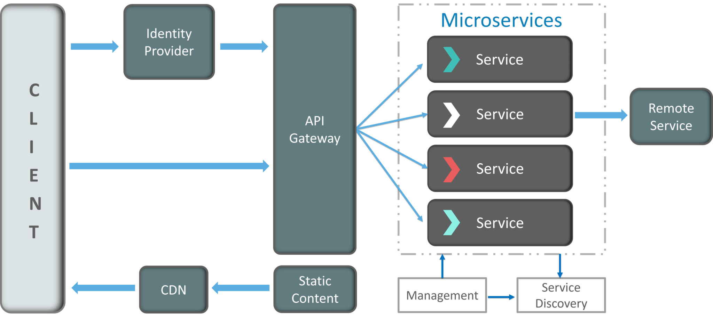

# Diseño

Tras el análisis del sistema realizado, en este tercer capítulo que nos ocupa ya estamos en posición de elaborar la arquitectura de nuestro proyecto. Dicha arquitectura estará apoyada por una introducción a las peculiaridades de esta, un diagrama a modo de resumen del estado actual, posteriormente una explicación de los detalles de cada microservicio construido y finalmente una comparativa entre las arquitecturas monolíticas y la de microservicios.

## Arquitectura de microservicios

El enfoque tradicional para el diseño de aplicaciones se ha centrado en la arquitectura monolítica, en esta todos los elementos de sus diferentes partes o módulos son desarrollados bajo una sola aplicación. Esto se traduce en una serie de desventajas claras, siendo especialmente importante que cuanto más grande es la aplicación, más difícil se vuelve resolver cada uno de los problemas que se generan e incluso la dificultad para añadir nueva funcionalidad rápidamente. 

Buscando soluciones a los problemas presentados se desarrolló una nueva forma de arquitectura, la basada en microservicios. Con esta se buscaba resolver los desafíos anteriores y además impulsar el desarrollo y la velocidad de respuesta en este.

### Definición

Actualmente no existe una definición clara de que son los microservicios, aunque podríamos decir que:

Una arquitectura de microservicios es un enfoque para desarrollar una aplicación software como una serie de pequeños servicios, cada uno ejecutándose de forma autónoma y comunicándose entre sí, por ejemplo, a través de peticiones HTTP a las API de cada microservicio. [Fuente](https://www.javiergarzas.com/2015/06/microservicios.html)

En las arquitecturas de microservicios, a diferencia del enfoque tradicional, los microservicios son elementos independientes que funcionan en conjunto para llevar a cabo las mismas tareas. En este enfoque, cada elemento o microservicio se encarga de una sola tarea, por tanto, el nivel de detalle, sencillez y capacidad para compartir procesos son elementos fundamentales en su desarrollo.

### Características: [Fuente](https://aws.amazon.com/es/microservices/)

- Autónomos: Cada servicio componente en una arquitectura de microservicios se puede desarrollar, implementar, operar y escalar sin afectar al funcionamiento de otros servicios. Además estos servicios no tienen, ni deben, compartir código alguno con el resto de servicios. Cualquier comunicación ocurre a través de las APIs.

- Especializados: Cada servicio está enfocado en resolver un problema y tiene sus capacidades propias. En el caso de que el módulo crezca, puede ser dividido en varios microservicios.

- Agilidad: Los microservicios propician una organización de equipos pequeños e independientes centrados en cada servicio. Por tanto, el contexto está mucho más acotado y comprendido, acortando los tiempos de los ciclos de desarrollo.

- Escalado flexible: Los microservicios permiten que cada servicio se escale de forma independiente para satisfacer la demanda. Esto permite adecuar las necesidades de la arquitectura en función de su uso.

- Implementación sencilla: Los microservicios permiten la integración y la entrega continuas. Esto facilita la actualización del código y acelera el tiempo de comercialización.

- Libertad tecnológica: En las arquitecturas de microservicios los equipos tienen libertad para elegir la mejor herramienta que resuelva cada problema específico.

- Código reutilizable: La división del software en pequeños módulos y bien definidos permite que dichos módulos puedan ser usados en otros contextos.

- Resistencia: La independencia del servicio aumenta la resistencia de una aplicación a los errores. En una arquitectura monolítica, un error puede provocar fallos en toda la aplicación. Con los microservicios, si hay un error en un servicio, las aplicaciones lo manejan degradando la funcionalidad sin bloquear toda la aplicación.

### Ejemplos:

Algunos diagramas de ejemplo de como sería una arquitectura basada en microservicios pueden ser los siguientes:


### Componentes:

Tomando como base la siguiente imagen, podemos desgranar la arquitectura basada en microservicios en los siguientes componentes: [Fuente](https://dzone.com/articles/microservice-architecture-learn-build-and-deploy-a)



- *Clients*: La arquitectura comienza con diferentes tipos de clientes, siendo estos dispositivos que intentan realizar diferentes usos de la aplicación.

- *Identity Providers*: Autentican a los clientes que realizan peticiones y comunican dichas consultas con la *API Gateway*.

- *API Gateway*: Los clientes no llaman a los servicios directamente, es la *API Gateway* la que actúa como punto de entrada para que los clientes envíen las solicitudes a los microservicios. Las ventajas de usar una *API Gateway* incluyen:
	- Todos los servicios pueden actualizarse sin que los clientes lo sepan.
	- Los servicios también pueden usar protocolos de mensajería que no son compatibles con la web.
	- La *API Gateway* puede realizar otras funciones transversales como proporcionar seguridad, equilibrio de carga, etc.

- *Messaging Formats*: Tenemos dos tipos de mensajes a través de los cuales se comunican:
	- Mensajes síncronos: en este los clientes esperan las respuestas del servicio. Los servicios suelen usar REST.
	- Mensajes asíncronos: en este caso los clientes no esperan las respuestas de los servicios, para ello se utilizan protocolos como AMQP, STOMP o MQTT.

- *Static Content*: Después de que los microservicios se comuniquen entre si, implementan el contenido estático en un servicio de almacenamiento basado en la nube que puede entregarlos directamente a los clientes a través de *Content Delivery Networks* (CDN).

- *Data Handling*: Cada microservicio posee una base de datos privada para capturar sus datos. Además, la base de datos de cada microservicio solo se actualiza a través de su API de servicio.


Además de estos componentes podemos encontrar otros dos que pueden aparecer en las arquitecturas típicas de microservicios.

- *Management*: Responsable de equilibrar los servicios en los nodos e identificar fallos.

- *Service Discovery*: Actúa como una guía entre microservicios para encontrar la ruta de comunicación entre ellos, ya que mantiene una lista de servicios en los que se encuentran los nodos.

### Ventajas y desventajas: [Fuente](https://docs.microsoft.com/es-es/dotnet/architecture/microservices/multi-container-microservice-net-applications/microservice-application-design)

No hay duda de que no estamos ante una arquitectura perfecta, como cualquier otra herramienta, tecnología o idea conceptual nace buscando satisfacer una serie de requisitos, mejorando las soluciones a problemas que encontramos en viejas arquitecturas. Es por ello que el listado de ventajas que encontramos es interesante, alentador y competente, aunque esto da a lugar a una serie de inconvenientes que tenemos que lidiar con ellos. Por tanto ahora presentamos ambas situaciones.

#### Ventajas

En una arquitectura basada en microservicios podemos encontrar ventajas como:

- Cada microservicio se puede diseñar, desarrollar e implementar independientemente de otros microservicios, lo que proporciona agilidad.

- Es fácil para los desarrolladores entender y trabajar con ellos, lo que aumenta la productividad.

- Es posible escalar horizontalmente áreas individuales de la aplicación. Una arquitectura de microservicios será mucho más eficaz con respecto a los recursos que se usan durante el escalado horizontal que una arquitectura monolítica.

- El trabajo de desarrollo se puede dividir en varios equipos, dedicando el esfuerzo de cada equipo a cada microservicio. Por tanto, cada equipo puede administrar, desarrollar, implementar y escalar su servicio de forma independiente.

- Los problemas son más aislados. Si se produce un problema en un servicio, inicialmente solo se ve afectado ese servicio (excepto cuando se usa un diseño incorrecto, con dependencias directas entre los microservicios) y los demás servicios pueden continuar con el control de las solicitudes.

- Se pueden usar las tecnologías más recientes.

#### Desventajas

Aunque también podemos encontrar algunas desventajas:

- La distribución de la aplicación agrega complejidad para los desarrolladores cuando diseñen y creen servicios.

- Una aplicación con muchos microservicios y que necesita alta escalabilidad supone un alto grado de complejidad de implementación para las operaciones de TI y administración.

- Aumento de las necesidades de recursos globales.

- Problemas de comunicación directa de cliente a microservicio. Un problema podría ser un error de coincidencia potencial entre las necesidades del cliente y las API expuestas por cada uno de los microservicios.

- Difícil refactorizar los contratos para los microservicios. Con el tiempo, es posible que a los desarrolladores les interese cambiar la forma en que el sistema se divide en servicios. Pero si los clientes se comunican, realizar esta refactorización puede interrumpir la compatibilidad.

### Conclusión:

Como podemos ver, tanto las ventajas, desventajas y peculiaridades de las arquitecturas de microservicios hacen que construir un sistema bajo su filosofía sea tanto un desafío como un arte. 

Una vez expuestos todos los puntos podemos afirmar que las arquitecturas basadas en microservicios son tanto útiles como potentes, y que trabajando en una buena planificación, diseño y documentación las ventajas que nos proporcionan a largo plazo son innumerables.

También queda latente la necesidad de estas arquitecturas de una fuerte infraestructura y de una buena selección tanto de herramientas como recursos para que desde el primer momento, nos proporcionen el mejor resultado.

Es por todos estos puntos por lo que en el presente proyecto hemos decidido lanzarnos, y a la vez aprovechar, al desarrollo de un proyecto con una arquitectura basada en microservicios.

- Fuente: [microservices](https://microservices.io/)

## Especificación de los microservicios

Una vez planteada la arquitectura que nos ocupa, en la sección actual presentaremos el diagrama que hemos elaborado el cual nos permitirá identificar los diferentes microservicios construidos y como se conectan entre si. Además, en la segunda parte hablaremos particularmente de cada uno, haciendo hincapié en los detalles y peculiaridades de cada uno.

### Diagrama de la arquitectura

El diagrama que ejemplifica el sistema construido hasta el momento es el siguiente:

---- Diagrama ----

Sin entrar en detalle aún, podemos identificar a simple vista como cada microservicio hace uso de una base de datos independiente, albergando en algunos casos varios modelos de datos distintos. Es destacable las oportunidades que nos otorga esta arquitectura, pues es muy interesante el hecho de poder definir cada detalle de tanto la infraestructura como el código o el diseño de un microservicio de forma única, optimizando este a sus requisitos particulares. Continuaremos trabajando en este aspecto.

### Microservicios desarrollados

Como segunda parte de la especificación de los microservicios nos sumergiremos en los detalles de estos. Comentaremos la idea que nos llevaron a construirlos, detalles de su implementación, o mejor dicho, su diseño, y algunos aspectos que consideramos relevantes comentar sobre el proceso de su elaboración.

#### Login

Primer microservicio creado en el proyecto y es que las razones parecen obvias, necesitamos poder tener usuarios en el sistema, registrarlos, y que estos puedan usarlo, por tanto, loguearse en él. Es relevante además ya que el resto de microservicio utilizan la información del usuario para guardar en sus modelos información como quién fue el usuario que creó el servicio, familiar o cliente, o quien fue quién lo modificó entre otras funciones.

Relativo a la implementación es interesante comentar que hemos hecho uso de [passport.js](http://www.passportjs.org/), un *middleware open source* para gestionar la autenticación, el cual trabaja en combinación con [Express.js](https://expressjs.com/), siendo este último el *framework* usado junto a *Node.js* para construir tanto este como el resto de microservicios.

La ventaja principal de usar *passport.js* es que nos permitirá la autenticación de nuestra aplicación haciendo uso de su abanico de más de 30 *plugins* disponibles creados bajo diversas estrategias. Ejemplos de estas estrategias serían mediante usuario y contraseña, Facebook, Google, Twitter... Resumiendo, nos permiten de una forma cómoda configurar nuestra aplicación para poder realizar el *login* del usuario de diversas maneras. En nuestro caso no hemos configurado aún nuestra aplicación para hacer uso de todo este abanico aunque está todo listo para completar el proceso. Finalmente comentar que presenta otras características como las siguientes:

- Single sign-on utilizando OpenID y OAuth.
- Manejo de la autenticación para controlar el éxito o el fallo del proceso
- Soporte de sesiones persistentes.
- Scope dinámico y distintos permisos de aplicación.
- Podemos implementar nuestras propias estrategias de autenticación.

En la siguiente imagen podemos ver como se configuraría *passport.js* para hacer uso en el proceso de login del usuario o del email junto con la contraseña: 


Añadir también que hemos preparado el microservicio para trabajar con las contraseñas de forma encriptada, y por tanto, almacenarlas de forma segura. En el código de más abajo podemos ver como desde el modelo creado podemos validar la contraseña y establecerla encriptada. Por último y pensando de cara al futuro, además de configurar la autenticación bajo nuevos servicios, sería interesante trabajar en hacer uso de *Json Web Token (JWT)*.


#### Defunción

Microservicio mas importante del proyecto, es el eje central de la idea diseñada. Pensando sobre un servicio funerario, toda la información inicial necesaria recae sobre el difunto, quien es, donde vive, cuando ha fallecido, etc. Por tanto, en el sistema ideado hemos querido tomar como base esa misma idea y construir en torno a este microservicio el punto de unión con el resto de microservicios. 

En definitiva lo que albergamos aquí es tanto los datos del difunto (nombre, DNI, sexo, fechas, etc) además de referencias a los identificadores del modelo de cliente y familiar asociados en este. Todo esto lo podemos encontrar dentro del modelo del difunto. Además dentro de este microservicio tenemos el modelo del servicio, que almacena información respecto a la fecha de la misa, entierro, lugar de realización, si el servicio es de compañía, entre otros datos. La razón de albergar ambos modelos en un mismo microservicio es que el modelo y la funcionalidad de servicio no tiene sentido aislado del difunto, y por esa razón se han construido juntos.

Si bien se han preparado *endpoints* para poder consultar, añadir y modificar la información de ambos por separado. Posibilitando incluso la creación y lectura de ambos en una mismo consulta. Como cabe de esperar el listado de *endpoints* disponibles es extenso ya que además de añadir, modificar o borrar la información, el microservicio nos tiene que permitir modificar tanto los clientes como los familiares asociados a cada difunto. Por tanto, siendo relevante en este aspecto, en la imagen siguiente podemos ver como quedaría el *router* creado para este microservicio: 


Otro punto interesante a comentar es que en el desarrollo del proyecto hemos intentado hacer uso de la funcionalidad asíncrona, promesas y demás ventajas de *Node.js* como puede verse en la imagen de más bajo. Este ejemplo es característico ya que sería para el caso de eliminar una defunción, y que por tanto, debe eliminar los familiares asociados y eliminar la asociación con el cliente (que no borrarlo en este caso). Por tanto, en las imágenes con las que concluimos este punto vamos a mostrar como hemos construido una función asíncrona que a su vez llama a otras funciones que realizan peticiones a microservicios externos, como podemos ver en la segunda imagen. 


#### Cliente

La idea bajo el presente microservicio es mas sencilla que en el resto aunque hay varios puntos a tener en cuenta. Principalmente los datos que almacenamos aquí son relevantes de cara a la realización de la factura final, ya que serán los datos del cliente los que se usarán en la facturación del servicio.

El otro punto en cuestión es el hecho de que podemos asociar un cliente a varios difuntos, lo que equivaldría a varios servicios facturados a un mismo cliente. Esto conlleva que cuando una defunción sea eliminada, como hemos comentado antes, se tenga que eliminar la asociación que los une. Aunque además tenemos la posibilidad por parte del microservicio del cliente de eliminar dicho enlace, siendo la lógica realizada en el controlador para esta funcionalidad la siguiente:


#### Log

Nuestra prioridad en el presente microservicio fue hacer uso de alguna librería que cumpliera con los requisitos necesarios, y de ese modo, nos simplificara la construcción de este. En líneas generales, la idea que nos ocupa es poder recibir mediante los diferentes *endpoints* la información de cada microservicio, procesarla en el sistema de log, y poder tanto mostrar el resultado creado en consola como almacenarlo en la colección de la base de datos que corresponda. 

Es por ello que tras una búsqueda, y análisis, de diversas opciones nos decantamos por [winstons.js](https://www.npmjs.com/package/winston). Tras configurarlo y realizar diversas pruebas nos encontramos con un problema inesperado. Y es que cuando se almacenaba la información en la base de datos, los datos importantes se formateaban de una forma especial, y posteriormente la recuperación de estos era imposible realizarla correctamente, y por tanto, no podíamos trabajar con ellos. 

Esto rompía con uno de los planes de futuro más interesantes de este microservicio, poder recuperar logs antiguos, y en consecuencia, analizar las diferentes acciones que los usuarios realizaron, o en definitiva, trabajar con ellos. Buscando nuevas alternativas y soluciones finalmente nos decantamos por implementar nuestro propio modelo que sería almacenado en la base de datos. De esta forma obtenemos total libertad a la hora de almacenar la información como deseamos y además, podemos continuar trabajando en el microservicio para realizar análisis, informes o cualquier otra funcionalidad que deseemos con los datos almacenados.

Antes de terminar con el microservicio de log sería interesante comentar la razón de disponer de este como un microservicio independiente y no como una colección más en cada uno de los microservicios implementados. Podríamos pensar que esta última opción es lógica pero deberíamos plantearnos una situación en la que por ejemplo necesitamos recuperar la información de varios microservicios a la vez de forma continuada. Esto conllevaría llamadas continuas a los *endpoints* de estos microservicios, en cambio, si lo creamos de forma independiente toda la información estaría centralizada y la carga de trabajo concentrada tan solo en el microservicio de log. Esta forma de trabajar se está convirtiendo en una norma especialmente en los sistemas *Cloud* o de contenedores y fue una de las principales razones para decidir este diseño.

#### Familia

Microservicio similar al de cliente, aunque este presenta una particularidad diferenciadora, y además, la razón de peso para la elección de *MongoDB*. Entrando en detalle, la situación que se nos presentaba es que tenemos que por ejemplo poder añadir el rol "hijos" y dentro de este necesitamos almacenar una lista de nombres, por tanto, la estructura para los familiares sería algo como lo siguiente:

```json
{
	"rol1": ["nombre_1", "nombre_2", "nombre_3"],
	"rol2": ["nombre_4", "nombre_5"],
	"rol3": ["nombre_6", "nombre_7", "nombre_8", "nombre_9"]
}
```

Viendo un ejemplo como el anterior fácilmente se nos viene a la cabeza la estructura de documentos o *Json* típicas de las bases de datos *NoSQL*. Por tanto, por razones como la que exponemos y algunas más que presentaremos más adelante nos decantamos por el uso de *MongoDB*. 

Por último y como curiosidad en el presente microservicio adjuntamos en la siguiente imagen la implementación del modelo de este:


## Arquitecturas monolíticas vs arquitecturas de microservicios

No podemos terminar este capítulo sin comentar y comparar una de las razones de mayor peso que nos llevó a la realización de este TFM.

Como ya se ha comentado en alguna ocasión, la realización del TFM estuvo basada en un proyecto similar al actual pero bajo un arquitectura monolítica. A modo de resumen, a la culminación de este nos dimos cuenta que la dificultad de continuar su desarrollo era alta, principalmente por una estructura demasiado rígida. Quizás por un mal diseño, quizás por una mala arquitectura. Pero vimos que para un proyecto como un ERP, con gran cantidad de módulos, enfocar toda la funcionalidad bajo un mismo controlador nos estaba llevando a un desarrollo complejo y muy dependiente cada módulo del resto.

Es por ello que, inspirados por los nuevos conocimientos adquiridos durante el máster, surgió la idea de presentar una idea similar bajo una nueva arquitectura, la de microservicios. La cual nos otorgaría la posibilidad de construir cada módulo de forma independiente y además, poder modificar cada uno de estos sin comprometer el resto, o incluso, añadiendo nuevos sin mayores complicaciones.

Una vez introducida la idea que nos llevó al uso de esta arquitectura queremos mencionar algunas diferencias teóricas entre ambos. Y es que queda claro que la arquitectura monolítica es la menos novedosa de ambas soluciones aunque durante mucho tiempo ha sido la solución perfecta para muchos proyectos.

Dicha arquitectura monolítica se estructura de forma que todos los aspectos funcionales quedan acoplados en un mismo programa. Por tanto, la información necesaria para el trabajo de este tipo de sistemas queda alojada dentro de un único servidor, y como consecuencia, no hay separación entre módulos.

Como solución novedosa sería la arquitectura de microservicios, presentando el paquete software en este caso no como un producto individual. Sino que, al contrario que el caso anterior, este presenta cada una se sus funciones de forma autónoma, lo que hace que sea mucho más sencillo de mantener y que responda con distintos niveles de eficacia dependiendo de la actividad que se genere.

En este punto estará claro que cada proceso o microservicio es un elemento independiente, significando que los cambios en uno de los elementos no afecta en absoluto al resto. Característica que ha demostrado ser muy efectiva.

Comentar también que una de las principales ventajas del sistema monolítico es su eficiencia, ya que el entorno suele estar muy bien definido. En contra posición, crea entornos muy rígidos, por lo que su mayor ventaja se convierte también en un aspecto negativo.

Pensando en resolver la situación anterior se dio forma a los microservicios. Además, la eficiencia en la gestión de los equipos de desarrollo también es una seña de identidad de estos. Ya que se pueden formar equipos multifuncionales sin demasiado esfuerzo. [Fuente](https://www.viewnext.com/arquitectura-de-microservicios-vs-arquitectura-monolitica/) 

Concluimos que la decisión final depende de las prioridades de cada proyecto, aunque la arquitectura de microservicios está aportando una alternativa de peso y cada vez más aceptada en los diferentes equipos de desarrollo. La posibilidad de crear, y sobre todo manejar, cada módulo de forma independiente es una gran ventaja, pero que implica la necesidad de un buen diseño y un control total de cada entorno desarrollado y la tecnología de este.
