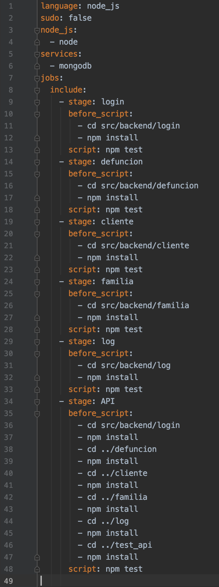
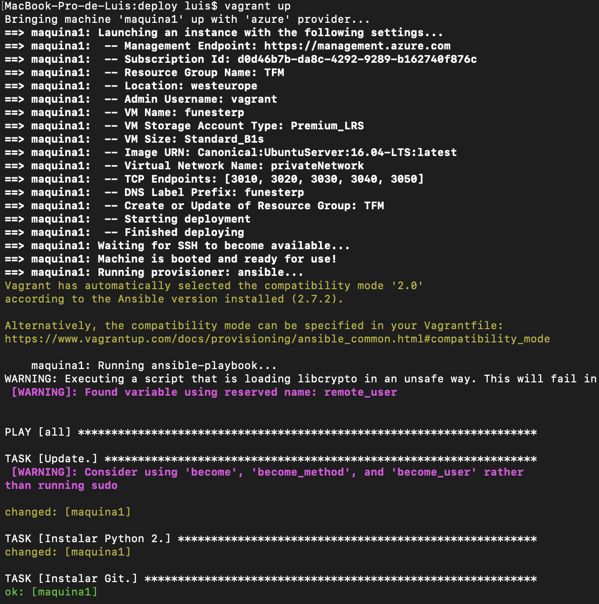
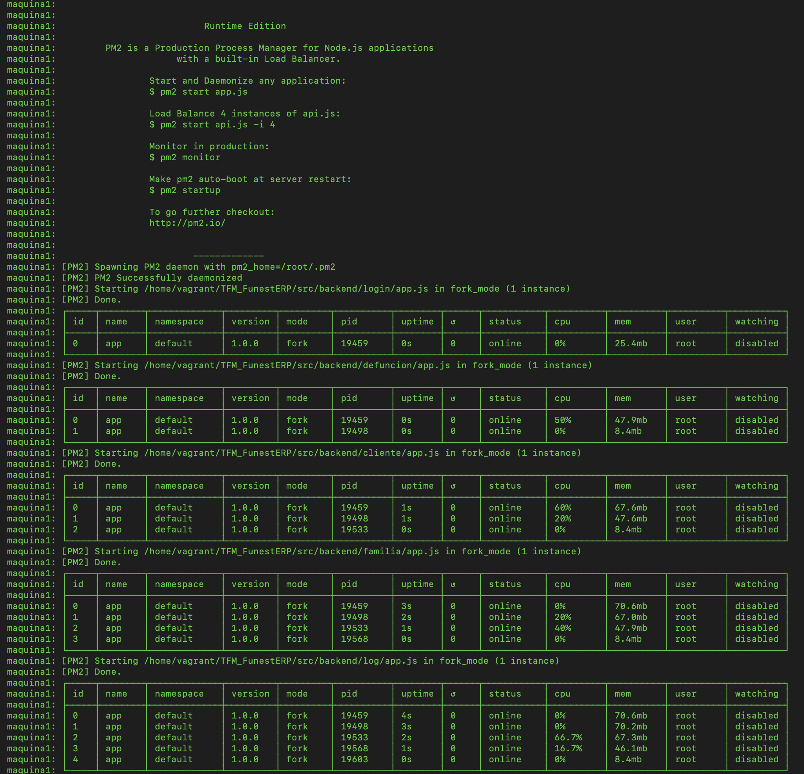

# Implementación

Tras el análisis al completo de los distintos requisitos de nuestro sistema, junto con el diseño de los microservicios e interacción entre ellos, expondremos en este capítulo las tecnologías usadas para el desarrollo del proyecto.

Como en la mayoría de aplicaciones web, se produce una clara división entre las tecnologías utilizadas en el lado del cliente (*frontend*) como en el lado del servidor (*backend*). En nuestro caso, y según el grado de realización del proyecto, nos vamos a centrar en el segundo caso, el *backend*, haciendo especial hincapié en el lenguaje de programación usado, y en las tecnologías que hemos trabajado respecto al *Cloud*.

## BackEnd

Núcleo de nuestro sistema, en él se realiza toda la funcionalidad de procesado, tratamiento y automatización de los datos. Servidor de nuestro proyecto, o más correctamente, servidores, ya que trabajamos bajo microservicios, podríamos definirlo como la parte del sistema que el usuario no puede ver o tocar pero que es el motor que mueve todas las aplicaciones. Generalizando, su función es atender a las peticiones del cliente, acceder a los datos necesarios para la petición, procesarlos y finalmente generar una respuesta.

Por tanto, ahora queremos presentar el que ha sido el lenguaje común para todos los microservicios, *Node.js*, presentando sus características y razones de su elección. Además introduciremos brevemente las librerías más usadas por los diferentes módulos.

### Node.JS

Comenzar comentando que el listado de opciones en cuanto lenguajes se refiere para el *backend* es por todos sabido que es extenso, incluso en nuestro caso, al hacer uso de microservicios podríamos haber usado varios. Pero como se comentó anteriormente, una de las bases de este proyecto era adentrarnos en un lenguaje moderno y desconocido para nosotros, aprender y mejorar. Es por ello, que junto con las razones que vamos a exponer, nos decantamos por *Node.js*. De hecho, otro lenguaje con el que planeamos trabajar en el proyecto es *Python*, pero será mas adelante cuando los nuevos microservicios lo requieran.

Por tanto, adentrándonos en los detalles de *Node.js*, primeramente añadir que *Node.js* por definición es un entorno de ejecución para *JavaScript* en el lado del servidor. Uno de los motivos para haber elegido *JavaScript* es que es un lenguaje ampliamente utilizado e íntimamente relacionado con el desarrollo web.

*Node.js* fue diseñado con la escalabilidad como preferencia, obteniendo la capacidad de soportar una gran cantidad de conexiones simultaneas a un mismo servidor. Entrando en detalle, emplea un único hilo y un bucle de eventos asíncronos, por tanto, las nuevas peticiones son tratadas como eventos en este bucle. Esto nos permite gestionar múltiples conexiones y peticiones de forma muy eficiente, lo que lo hace apropiado para aplicaciones con un gran número de conexiones simultáneas. Esto es interesante en nuestro proyecto, ya que pensando ambiciosamente, el proyecto puede ser aceptado por un gran número de clientes, y por tanto sus usuarios deberán acceder a la aplicación para trabajar, lo que desembocaría en un gran número de peticiones simultaneas que manejar y procesar.

También dentro de *Node.js* encontramos que está orientado a eventos (POE), está pensando para operaciones de entrada y salida sin bloqueos y además está basado en el motor V8 de *Chrome*, uno de los más avanzados a nivel de *JavaScript*. En definitiva cumple con todos los requisitos para ser usado en proyectos web. También es común usarlo tanto en *IOT* como en aplicaciones *socket*.

- [Fuente](https://www.luisllamas.es/que-es-node-js/)
- [Fuente](https://openwebinars.net/blog/por-que-usar-nodejs/)

### Bibliotecas Externas

Para el correcto desarrollo del proyecto también ha sido necesario hacer uso de distintas librerías. Gran cantidad de herramientas son las que se distribuyen libremente entre la comunidad, sin duda una aportación muy importante para poder construir sistemas elegantes, robustos y funcionales en una cantidad de tiempo mucho menor.

Dentro de las bibliotecas externas usadas podemos encontrar:

- [Express](https://expressjs.com/): *Framework* rápido, minimalista y flexible construido para *Node.js*. Nos permite crear APIs y aplicaciones web fácilmente, además nos provee de un buen conjunto de características como son manejo el de rutas (direccionamiento), archivos estáticos, uso de motor de plantillas, integración con bases de datos, manejo de errores y *middlewares* entre otras.
- [Mongoose](https://www.npmjs.com/package/mongoose): Herramienta de modelado de objetos *MongoDB*, esta diseñado para trabajar en un entorno asíncrono. Además admite promesas y devoluciones de llamadas. En definitiva nos permite manejar nuestra conexión con las diferentes bases de datos.
- [Axios](https://www.npmjs.com/package/axios): Cliente HTTP basado en promesas para *JavaScript*. Utilizando esta herramienta es muy sencillo enviar peticiones a *endpoints* REST y realizar operaciones CRUD. Esta ha sido la razón de su uso en el proyecto, ya que en ocasiones hemos tenido que realizar peticiones entre microservicios.

### Manual de usuario

- Presentar las diferentes acciones que pueden hacerse.

## Base de datos

Nos adentramos en el análisis de ese "almacén" que nos permitirá guardar la diferente información que se usará en cada microservicio. Pieza importante de muchas aplicaciones web, en nuestro caso se vuelve esencial.

Hasta ahora estábamos acostumbrados a utilizar bases de datos *SQL* como MySQL o Oracle, por ejemplo, pero desde hace unos años han tomado especial relevancia las denominadas *NoSQL*, las cuales presentan un importante número de características tanto interesantes como útiles, lo que hace de la elección de estas un verdadero reto. Por tanto en la presente sección trataremos de introducir ambos tipos, centrándonos en sus características, y elegiremos la que mejor se adapte a nuestras necesidades.

Antes de comenzar es interesante exponer los criterios de aceptación marcados en la historia de usuario, los cuales debemos de tener presentes en todo el proceso de elección. Siendo los siguientes:
- La base de datos nos debe permitir un crear un esquema flexible. Es decir, debemos poder trabajar con datos no estructurados o semiestructurados.
- La base de datos debe usar un modelo de datos eficiente e intuitivo, como puede ser *Json* por ejemplo.
- Sería ideal trabajar en una versión *Cloud* de la base de datos elegida.
- No debe generar cuellos de botella.
- Nos debe proporcionar buena escalabilidad.
- Debemos de poder usar tanto una versión para los tests como otra independiente para los datos reales.

### SQL vs No-SQL

Una base de datos relacional (SQL) es aquella que almacena y proporciona acceso a puntos de datos relacionados entre sí. Se basa en el modelo relacional y está formada por filas, las cuales son un registro con un ID único llamado clave y columnas, conteniendo estas los datos. 

En el caso de las bases de datos no relacionales (NoSQL) son aquellas que tienen esquemas flexibles y que usan un modelo de almacenamiento que está optimizado para los requisitos específicos del tipo de dato que se almacena. Por ejemplo, datos como pares clave-valor, documentos *Json* o grafos.

Aunque la lista de características diferenciadoras entre ambos tipos puede ser extensa, vamos a presentar las que consideramos principales.

| | SQL | NoSQL |
| -- | -- | -- |
| Cargas de trabajo óptimas | Destacan para el procesamiento de transacciones online y también para el procesamiento analítico online. | Diseñadas para hacer análisis sobre datos semiestructurados. |
| Modelo de datos | Esquema estricto de tablas, filas, columnas, índices y relaciones entre tablas. | Variedad de modelos de datos como clave-valor, documentos y gráficos, optimizados para el rendimiento y escalado. |
| ACID | Ofrecen propiedades de atomicidad, coherencia, aislamiento y durabilidad. | Flexibilizan las propiedades ACID para crear un modelo de datos más flexible que se pueda escalar horizontalmente. |
| Consistencia | Debe configurarse para una fuerte consistencia. | Depende del DBMS, ya que algunos ofrecen una consistencia fuerte, mientras que otros ofrecen solo una consistencia eventual. |
| Rendimiento | Se necesita la optimización de consultas, índices y estructura para lograr un máximo rendimiento. | Depende del *clúster* de *hardware* subyacente, la latencia de red y la aplicación que efectúa la llamada. |
| API | Las consultas se ajustan a un lenguaje de consultas estructurado (SQL) | Las claves de partición permiten que las aplicaciones busquen pares de clave-valor, conjuntos de columnas o documentos semiestructurados que contengan atributos y objetos de aplicación serializados. |

Si bien ambas soluciones son viables para nuestro problema, nos decantaremos por la opción *NoSQL* principalmente por las características de su modelo de datos. En nuestro sistema es llamativo, y en gran medida necesario, disponer de una estructura flexible, por ejemplo a la hora de añadir la información de los familiares para los distintos documentos (esquelas). Para estos necesitaremos almacenar valores del tipo clave-valor o como documentos, por lo que la base de datos *NoSQL* es prioridad.

¿Se podría usar un tipo de base de datos distinto según el microservicio que nos ocupe? Si, se podría y quizás sea una gran solución, pero al ser este proyecto una primera aproximación a un proyecto futuro más grande, en principio la idea de usar para todos los microservicios el mismo tipo de base de datos resulta más óptimo, tanto en cuanto a tiempo como a dificultad. Quizás en el futuro esta solución se pueda ampliar.

### Tipos de bases de datos No-SQL

Ahora que ya tenemos claro el tipo de base de datos que vamos a usar necesitamos decidir entra las distintas opciones que podemos encontrar dentro de las NoSQL. Esta elección se presenta más obvia, ya que buscamos la máxima flexibilidad posible, pero igualmente presentaremos algunas de las distintas alternativas que podemos encontrar.

- Clave-valor: Básicamente es una tabla *hash* grande. Nos permite asociar cada valor de datos con una clave única y el almacén clave-valor usará esta clave para almacenar los datos mediante el uso de una función *hash* adecuada. Permiten escalado horizontal a escalas que otros tipos de bases de datos no pueden alcanzar y se caracterizan por ser muy eficientes tanto para las lecturas como para las escrituras. Los casos de uso como juegos, tecnología publicitaria e IoT se prestan particularmente bien con el modelo de datos clave-valor. Algunos ejemplos de este tipo son Cassandra, BigTable o HBase.
- Documentos: Un almacén de datos de documentos administra un conjunto de campos de cadena con nombre y valores de datos de objeto en una entidad que se conoce como un documento. Normalmente, estos almacenes guardan los datos en forma de documentos JSON o XML. Facilitan a los desarrolladores el almacenamiento y la consulta de datos en una base de datos mediante el uso del mismo formato de modelo de documento que emplean en el código de aplicación. El modelo de documentos funciona bien con catálogos, perfiles de usuario y sistemas de administración de contenido en los que cada documento es único y evoluciona con el tiempo. Algunos ejemplos de este tipo son MongoDB o CouchDB.
- Grafos: Administra dos tipos de información, nodos y bordes. Los nodos representan entidades y los bordes especifican las relaciones entre estas entidades. El propósito de un almacén de datos de grafos es permitir a una aplicación realizar consultas de manera eficaz que recorran la red de nodos y bordes y analizar las relaciones entre las entidades. Los casos de uso típicos para una base de datos de gráficos incluyen redes sociales, motores de recomendaciones, detección de fraude y gráficos de conocimiento. Algunos ejemplos de este tipo son Neo4j y Giraph.
- Objetos: Optimizados para almacenar y recuperar objetos binarios grandes como imágenes, archivos, transmisiones de vídeo y audio, objetos de datos de aplicación de gran tamaño, documentos e imágenes de disco de una máquina virtual. Un objeto se compone de los datos almacenados, algunos metadatos y un identificador único para acceder a él. Un caso especial de almacenes de datos de objetos es el recurso compartido de archivos de red, este permite que se acceda a los archivos a través de una red mediante protocolos de red estándar como el protocolo SMB. Algunos ejemplos de este tipo de bases de datos son Zope o Db4o.

Nuestro proyecto se podría englobar dentro de la categoría de "sistemas de administración de contenido" por lo que la opción de usar MongoDB es la más atractiva.

### Database as a Service

Tal y como podíamos ver en los criterios de aceptación, la idea de disponer de nuestra base de datos de forma independiente al proyecto puede ser una interesante forma de aislar los datos que almacenamos de la aplicación en sí. Consiguiendo de esta forma tener la seguridad de que los datos nunca se verán alterados por posibles despliegues fallidos o eliminaciones de recursos inesperados dentro del sistema *Cloud*.

Para solucionar esta cuestión disponemos de *DBaaS*(Database as a service). Con este término nos referimos a la ejecución y gestión de las bases de datos alojadas dentro de la infraestructura del proveedor de servicios. Normalmente también se refiere a un servicio de pago por uso que permite el acceso *on demand* a los ficheros, consiguiendo tanto reducción de costes como escalabilidad conforme a las necesidades.

Las razones que podemos encontrar para usar un DBaaS respecto a otras soluciones, como por ejemplo, provisionar, orquestar y desplegar tu propio sistema de base de datos, puede ser extensa, por lo que vamos a enumerar y comentar las que consideramos relevantes:
- Backups, normalmente diarios. Además de sencillas restauraciones de los datos.
- Automatización en la nube: Aprovisionamiento bajo demanda, escalado sin interrupciones y alta disponibilidad.
- Herramientas de monitoreo, visibles desde gráficos y alertas personalizables.
- Alta seguridad, por lo general haciendo uso de SSL, además de *firewalls* personalizados.

### Elección final

Después del análisis presente añadir que el mismo *MongoDB* dispone de su solución *DBaaS*, denominada *Atlas*, pero en nuestro caso usaremos [mLab](https://mlab.com/). La decisión se basa principalmente por la facilidad de su configuración tanto a la hora de crear una base de datos en su sistema como de conectar con ella desde el código. Además dispone de una versión gratuita.

- [Fuente](https://www.oracle.com/ar/database/what-is-a-relational-database/)
- [Fuente](https://docs.microsoft.com/es-es/azure/architecture/data-guide/big-data/non-relational-data)
- [Fuente](https://aws.amazon.com/es/nosql/)
- [Fuente](https://www.mongodb.com/cloud-database)
- [Fuente](https://apser.es/dbaas-base-de-datos-en-la-nube/)

## Integración continua

La integración continua es una práctica de desarrollo de software mediante la cual los desarrolladores combinan los cambios en el código en un repositorio central de forma periódica, tras lo cual se ejecutan versiones y pruebas automáticas. La integración continua se refiere en su mayoría a la fase de creación o integración del proceso de publicación de software. 

Los objetivos clave de la integración continua consisten en encontrar y arreglar errores con mayor rapidez, mejorar la calidad del software y reducir el tiempo que se tarda en validar y publicar nuevas actualizaciones de software. Por tanto, con la integración continua, los desarrolladores envían los cambios de forma periódica a un repositorio compartido con un sistema de control de versiones como *Git*. 

[Fuente](https://aws.amazon.com/es/devops/continuous-integration/)

### ¿Qué me aporta?

Es importante destacar los beneficios que aportan las herramientas de este tipo y que además justifican la necesidad de su uso en cualquier proyecto software moderno.

- Detectan rápidamente posibles errores de compilación o de instalación.
- Detectan funcionamientos anómalos en el software, gracias a la realización de pruebas más frecuentes.
- Mejora de la productividad de desarrollo, ya que libera a los desarrolladores de ciertas tareas manuales.
- Mejora la calidad de nuestro producto.
- Entrega de actualizaciones con mayor rapidez y frecuencia.

- [Fuente](https://aws.amazon.com/es/devops/continuous-integration/)
- [Fuente](https://www.campusmvp.es/recursos/post/integracion-continua-que-es-y-por-que-deberias-aprender-a-utilizarla-cuanto-antes.aspx)

### Criterios de aceptación

Una vez presentado que es la integración continua es el momento de mencionar los diferentes criterios definidos en las historias de usuario que consideramos de especial relevancia para la elección de una herramienta u otra del mercado:

- Integración con *Github*.
- La herramienta de integración podrá lanzar y verificar que los tests se pasan correctamente.
- La herramienta nos permitirá desplegar automáticamente en el sistema *Cloud* elegido.
- Los tests deben poder realizarse en cada microservicio de forma independiente.
- El coste de administración y uso de la herramienta deberá ser sencillo.
- Debe tener un plan gratuito.
- Debe tener soporte para hacer uso de *Docker*.
- Debe tener una interfaz de usuario.
- Debe soportar notificaciones por correo.
- *Open source*.

### Elección final

La oferta en cuanto a herramientas de integración continua podemos decir que es amplia, siendo los más populares *Jenkins, Circle CI y TravisCI*. Si bien todos cumplen en gran medida los requisitos planteados, en nuestro caso nos hemos decantado por *TravisCI*.

En el caso de Jenkins, el que seguramente sea el más completo, tiene una curva de aprendizaje alta y además hace uso de un archivo de configuración propio (Jenkinsfile, no yml), lo que hace aún más complejo el adaptarse a la herramienta. CircleCI es otra gran opción y bastante potente en cuanto al despliegue posterior de los cambios (*continuous delivery*). 

Pero como hemos dicho, en nuestro caso nos hemos decidido por TravisCI. Su gran apuesta por el software libre es importante, además de la facilidad tanto en su uso como en su configuración. Como característica interesante podemos comentar que nos permite testear diferentes versiones de los lenguajes y paquetes. Y como último detalle, TravisCI nos permite ejecutar *scripts* una vez que los tests hayan finalizado con éxito, lo que puede ser de utilidad tanto para desplegar los cambios en sistemas *Cloud* como por ejemplo en *Docker*, entre otros.

- [Fuente](https://dzone.com/articles/maze-of-continuous-integration-engines)
- [Fuente](https://www.katalon.com/resources-center/blog/ci-cd-tools/)
- [Fuente](https://djangostars.com/blog/continuous-integration-circleci-vs-travisci-vs-jenkins/)

### Trabajando con Travis

Una vez introducidas las ideas esenciales bajo la integración continua y elegida la herramienta para nuestro proyecto, no queremos dejar pasar la oportunidad de comentar nuestra experiencia. Para ello hablaremos rápidamente de los pasos necesarios para hacer uso de *Travis* y sobre todo, del archivo de configuración que guía a la herramienta.

Los pasos a seguir para su configuración son bastante sencillos, ya que una vez que tenemos nuestro repositorio de *Git* creado, en nuestro caso *Github*, tan solo tenemos que habilitar el acceso de *Travis* a este. Después en *Travis* debemos añadir el repositorio con el que queremos trabajar. En pocas palabras, tenemos que vincular ambas plataformas.

Pero aún tenemos pendiente un paso más, ya que por ahora *Travis* no sabe que debe hacer con nuestro proyecto. Para ello definimos un archivo denominado *travis.yml*. En el básicamente definimos los servicios necesarios y los diferentes *jobs* que debe realizar. En nuestro caso tan solo necesitamos que ejecute los tests de cada microservicio, por lo que las diferentes tareas definidas se encargan de indicarle la ruta correcta y el archivo a ejecutar. Podemos ver un ejemplo de nuestro archivo *travis.yml* en la siguiente imagen.

Después, una vez que hagamos *push* a *git* se realizarán las diferentes acciones que hemos indicado en dicho archivo. Comentar además que podríamos definir aquí acciones también para realizar el despliegue de nuestro proyecto en el *Cloud* directamente, aunque en nuestro caso hemos preferido hacer uso de un orquestador.

En líneas generales esto sería todo para tener el servicio de integración continua funcionando. Para finalizar en la siguiente imagen podemos ver un ejemplo de *Travis* funcionando para nuestro trabajo, que como detalle relevante, podemos ver en la parte inferior como ha creado diferentes *jobs* para cada uno de los microservicios implementados (aunque en la imagen no entraban todos).

### Github

No podemos entender la integración continua sin una parte fundamental de esta, *Git*. Podemos definir *Git* como una herramienta que realiza la función del control de versiones del código de forma distribuida. No queremos entrar en más detalles, ya que es de sobra conocidas las bondades de esta aplicación. Añadir que en nuestro caso hemos hecho uso de *Github*.

Pero sí hay un punto donde queremos entrar en detalle, y es referente al uso que hemos hecho de este para organizar las tareas pendientes por abordar. Como vimos anteriormente definimos una serie de historias de usuario que planteamos realizar. Por tanto, para llevarlas a cabo las hemos expuesto dentro del sistema de *milestones* e *issues* de *Github*. De esta forma hemos ido definiendo una serie de *milestones*, que se corresponden con las historias de usuario, y dentro de estos hemos desgranado las diferentes tareas necesarias para llevarlas a cabo, como podemos ver en las dos imágenes siguientes.

Como punto extra, y de interés para realizar dichos *milestones-issues*, es que esto nos posibilita enlazar cada *commit* con la tarea a la que esté asociado. De esta forma es realmente sencillo tener claro y bien distribuido el trabajo referente a cada tarea, y así, saber en todo momento el estado de cada una de estas. Podemos ver un ejemplo de una tarea cualquiera más abajo.

## Provisión

Las herramientas de aprovisionamiento nos permiten crear distintas configuraciones para cada uno de nuestros servidores por medio de código, e incluso algunas de ellas permiten automatizar procesos de despliegue y administración tanto de maquinas individuales como granjas de servidores. 

Como veremos existe una delgada línea que separa las posibilidades de estas herramientas de las encargadas de la orquestación ya que en algunos casos las herramientas de aprovisionamiento pueden llegar a cubrir ambas tareas. En nuestro caso nos hemos decantado por dos herramientas que están enfocadas cada una en una parte concreta de este proceso y por tanto claramente delimitadas sus funciones.

Podríamos preguntarnos porqué es útil para cualquier proyecto realizar el aprovisionamiento por medio de código, y con tan solo la definición anteriormente planteada podría ser más que suficiente. Además vamos a exponer una serie de ventajas que nos confirmarán nuestra apuesta por estas herramientas:

- El aprovisionamiento se puede configurar una vez y ejecutarlo varias veces en uno, decenas o cientos de servidores, y por tanto, evitar mucho trabajo repetitivo.
- El código nos ilustra los pasos para la creación de la configuración del servidor, además suele ser bastante fácil de entender este.
- Si nos encontramos cualquier problema de configuración tan solo tenemos que modificarlo en este archivo y volver a lanzar la herramienta de aprovisionamiento para tener nuestras máquinas con las correctas configuraciones y actualizadas.

Cabe destacar que además de estas ventajas, las herramientas de aprovisionamiento se combinan a la perfección con la tendencia actual de virtualización. Gracias a esta, resulta muy sencillo crear servidores casi al instante aprovechando otras herramientas complementarias como la de aprovisionamiento.

Antes de mostrar la configuración establecida comentar que en nuestro caso nos hemos decantado por *Ansible* como herramienta de aprovisionamiento. Está construido en python y tan solo requiere las credenciales de acceso *SSH* al servidor para poder operar, ejecutando en este *playbooks* donde se especifican los pasos de forma secuencial. 

Podemos encontrar otras opciones en el mercado como puede ser *Terraform*, muy similar a *Ansible* pero con algunas funcionalidades distintas enfocadas al *gitflow*. *Puppet* es otra herramienta aunque enfocada a los administradores de sistemas y pensada para orquestar grandes cantidades de servidores. La última opción interesante es *Chef*, escrito en Ruby está orientado a los desarrolladores, ya que la configuración de los servidores se realiza por medio de procedimientos.

Añadir que no hay un claro ganador, todos ofrecen cosas similares pero varían los caminos y mecanismos. En nuestro caso hemos encontrado *Ansible* muy sencillo de usar y con un gran potencial, ideal para nuestros primeros pasos. Presentamos ahora el *playbook* que hemos definido para el aprovisionamiento de nuestra máquina virtual:

Como podéis ver, inicialmente establecemos una serie de parámetros de configuración para la ejecución de Ansible en el servidor y posteriormente dentro del apartado *tasks*, de forma secuencial, definimos la configuración que estableceremos dentro de este. De forma resumida comentar que instalamos *Python* como requisito para poder instalar *git*. Después descargamos nuestro repositorio e instalamos algunas dependencias extras necesarias para poder trabajar en el servidor, además de *Node.js*. Por último, nos situamos en la localización de cada microservicio e instalamos sus dependencias, para terminar instalando *pm2*, el cual se encarga de ejecutar en segundo plano cada microservicio. Aunque cabe indicar que la ejecución de este la realiza el orquestador, en el aprovisionamiento tan solo instalamos el paquete. A modo de ejemplo de su funcionamiento, en la siguiente imagen podemos ver como sería la ejecución del aprovisionamiento dentro del proceso de despliegue:

A grandes rasgos estas serían las características de este tipo de herramientas y el uso que en nuestro proyecto hacemos de ellas, por tanto ahora es el momento de presentar las características de nuestro orquestador, *Vagrant*.

- [Fuente](https://www.arsys.es/blog/herramientas-de-aprovisionamiento/)

## Orquestación

Instalar el mismo entorno de trabajo una y otra vez es un trabajo repetitivo y agotador, además, pensando en una etapa de desarrollo, incrementa el tiempo de este al no ser una tarea instantánea. Es en este punto donde entran en juego las herramientas de orquestación, ya que nos permiten instalar y configurar (en conjunto con los aprovisionadores) las diferentes máquinas de nuestro proyecto de forma sencilla.

En nuestro caso hemos hecho uso de *Vagrant*, centrándonos con este en la gestión del despliegue de la máquina virtual. Comentar que es difícil encontrar otras herramientas que cubran las posibilidades de *Vagrant* por lo que su elección ha sido obvia, aunque podemos añadir que tanto su uso como su configuración es bastante sencilla de realizar por lo que podemos afirmar que forma un gran equipo junto a *Ansible*.

Pero aún nos podemos preguntar ¿qué es *Vagrant*?. Es una herramienta que nos ayuda a crear y manejar máquinas virtuales con un mismo entorno de trabajo. Nos permite definir los servicios a instalar así como también sus configuraciones. Cabe destacar que no tiene la capacidad para correr una máquina virtual sino que simplemente se encarga de las características con las que debe crearse esa máquina y los completos a instalar, es decir, necesitamos apoyarnos de aplicaciones como *VirtualBox* o desplegar directamente en sistemas *Cloud* como *Azure*.

La gran ventaja de *Vagrant* es que posee un archivo de configuración denominado *Vagrantfile* donde se centraliza toda la configuración de la máquina virtual que creamos. Lo genial es que puedes utilizar ese mismo archivo para crear una máquina exactamente igual cuantas veces quieras. Además de poder crear varias máquinas a la vez cada una con una configuración distinta, ejecutando distintos comandos en ellas o incluso haciendo uso de varios aprovisionadores. Todo un sin fin de características que te ayudan enormemente a personalizar cada una de tus máquinas y de poder crearlas y eliminarlas tantas veces como quieras de una forma súper liviana y rápida. 

Tras la introducción a *Vagrant* y los orquestadores, vamos a presentar el *Vagrantfile* que hemos definido para nuestra máquina.

Comentar brevemente lo que podemos ver en la imagen anterior. En nuestro caso hacemos uso de un *box* específico para poder desplegar en *Azure* (*azure-dummy*), encargándose este de los requisitos necesarios para poder conectar con *Azure*. Posteriormente indicamos la localización de nuestras claves *SSH*, pues al igual que *Ansible*, establece la conexión bajo dicho protocolo. 

Posteriormente establecemos la configuración de la máquina, para ello primero asignamos las credenciales de nuestra cuenta en *Azure* mediante variables de entorno. Después podemos ver los detalles de la máquina que crearemos, siendo estos el tipo de sistema operativo que se instalará, el tamaño de la máquina, el grupo de recursos donde se creará (el cual también se crea durante el despliegue), la localización, los puertos que estarán accesibles desde el exterior (uno por cada microservicio) y finalmente la red virtual que se creará también en dicho grupo de recursos. Como podemos ver en la última parte del archivo, tras la configuración de la máquina se asigna los datos (la localización del *playbook*) del aprovisionador para que este ejecute su configuración, para terminar con la ejecución de una serie de ordenes (definidas al principio del archivo) para levantar cada uno de los microservicios.

Como cabe esperar, la ejecución de *Vagrant* nos presenta un largo *log* en la terminal por lo que en las siguientes imágenes podemos ver el comienzo de este y la parte final, obviando la parte intermedia enfocada en el aprovisionamiento, el cual ha sido mostrado en la anterior sección.

Para terminar añadir que otra de las características, y bastante útil además, es que *Vagrant* nos permite acceder a las máquinas de forma sencilla, y así poder trabajar dentro de ellas para lo que necesitamos. En la última imagen de este apartado mostramos como sería el simple proceso de acceso.

- [Fuente](https://javiermartinalonso.github.io/devops/devops/vagrant/2018/02/07/Vagrant-Introduccion.html)

## Despliegue

- Defender elección de Azure. En este caso presentaremos características,
alguna comparativa con AWS y/o Google Cloud. 
	- Defender de forma sencilla.
- Exponer algunos detalles de Azure.
- Mostrar capturas de pantalla de: 
	- El grupo de recursos con cada máquina virtual independiente.
	- Acceso desde vagrant y captura de los tests de algún microservicio

### Manual de usuario

- Presentar las diferentes acciones que pueden hacerse.
- Mostrar cuestiones que sean relevantes.

