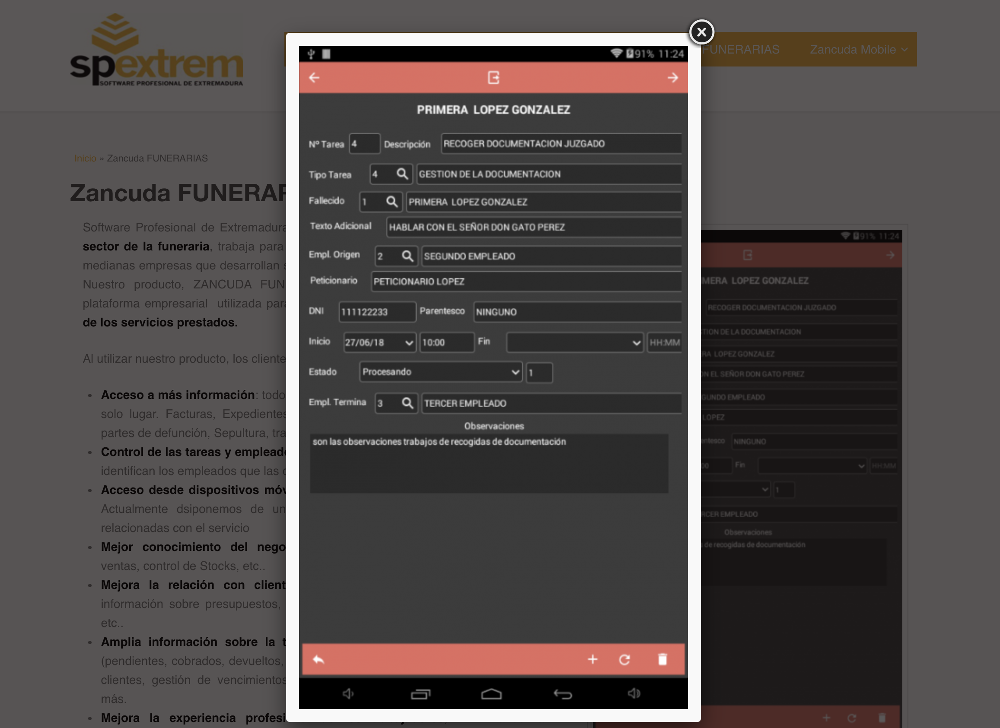
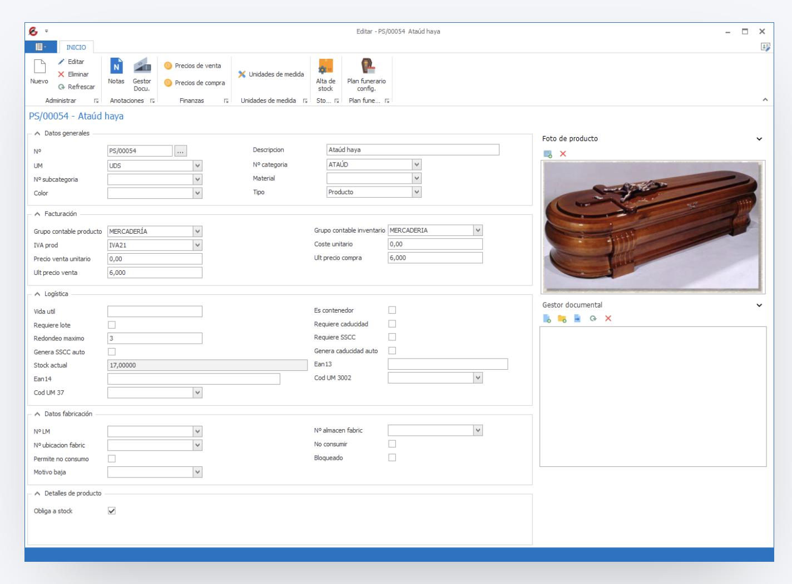
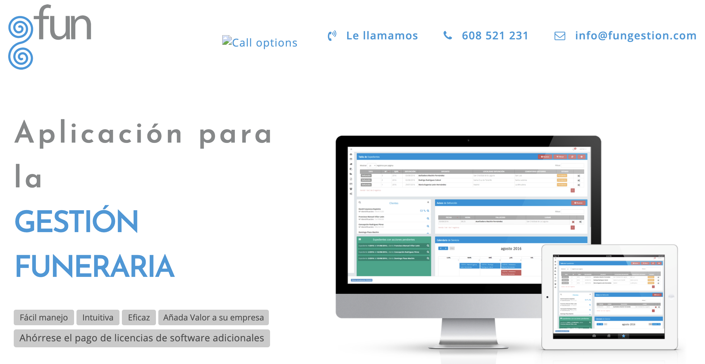
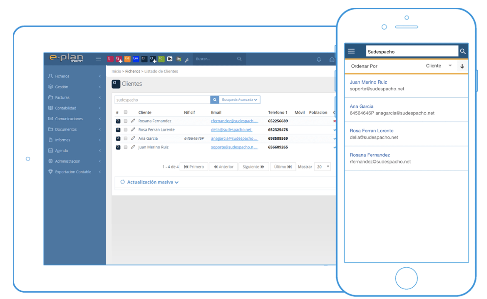

# Introducción

Vivimos una época en la que el auge de las tecnologías de de la información y la comunicación es toda una realidad. Dejamos atrás los trabajos más manuales en favor de un avance hacia la automatización de procesos, facilitando así el desempeño y, en la mayoría de ocasiones, mejorando el resultado, minimizando errores humanos y ganando tiempo, siendo el sector tecnológico puntero en todos estos aspectos.

Por ello, la motivación central de este proyecto nace de la necesidad, y oportunidad, de presentar una herramienta que nos permita mejorar el proceso que se sigue en el servicio ofrecido en una empresa funeraria, en este caso una pequeña empresa. Actualmente, el proceso que comentamos implica la generación de diferentes documentos, cada uno individual, pero con una gran cantidad de datos que se repiten en estos. De ahí nace la oportunidad de centralización del proceso, ya que partiendo de una recolección inicial de datos, se puede automatizar gran cantidad de trabajo requerido. De esta forma ganamos en tiempo y en recursos para una empresa.

Actualmente es difícil encontrar software que satisfaga al completo el sector que nos ocupa, siendo la oferta que encontramos principalmente obsoleta, además de genérica y en muchas ocasiones especializada en otros aspectos o sectores. Es por ello que este es el inicio de un proyecto de futuro, un proyecto con unas miras mucho más alejadas de esta primera versión que presentamos. En definitiva, un proyecto global de gestión de funerarias, tanatorios y crematorios.

La segunda, y no menos importante, motivación para el desarrollo de este TFM ha sido el uso de tecnologías modernas correspondientes principalmente al universo *Cloud*, a las arquitecturas que lo ocupan y al gran número de herramientas que giran en torno a este. El uso de este conglomerado nos proporciona facilidades para el control de la infraestructura, su despliegue y construcción, y de este modo, conseguimos desarrollar un proyecto completo basado principalmente en, microservicios.

No es ningún secreto que el *Cloud* ya es parte de nuestras vidas, y que gran cantidad del software que se desarrolla en la actualidad nace directamente para esta plataforma, siendo por tanto este, el eje neurálgico de la innovación en cuanto a tecnología de la información y computación se refiere.

## Conceptos básicos

En líneas generales podemos definir un sistema de información como un conjunto de componentes o módulos que están interrelacionados entre sí. Estos módulos recolectan, procesan y almacenan información. Además, comparten dicha información, creando así una cadena de trabajo para conseguir una serie de objetivos comunes.

Para realizar dichos objetivos, un sistema de información presenta una serie de actividades generales. El primer paso estaría ocupado por la entrada de datos, los cuales son sometidos a diversas transformaciones para posteriormente poder ser procesados y finalmente distribuidos. Este último paso suele conllevar un almacenamiento y posterior realimentación hasta la etapa inicial.

Como podemos ver, el sistema es un circuito que se retroalimenta. Partimos de la necesidad de generar una serie de documentos, para los cuales primero necesitamos realizar todo un proceso de inserción de datos.

Un concepto importante por definir en este punto inicial de la documentación es el de *servicio*. Es interesante aclararlo ya que a lo largo de esta documentación aparecerá de forma intensiva y fácilmente podríamos caer en el pensamiento de servicio desde la perspectiva de nuestro sector aunque en la mayoría de los casos la idea que intento expresar es distinta.

El concepto de servicio dentro de esta documentación principalmente estará ligado al de *servicio funerario*, comprendiendo este el conglomerado de acciones que se realizarán cuando la empresa está trabajando para un cliente. Por tanto, y valga la redundancia, estaríamos hablando de todos los servicios que presta la empresa a un cliente.

## Antecedentes

Sumergidos en la era de la información, la idea fundamental del proyecto nace de la necesidad de evolución que viven muchas empresas en la actualidad. Necesidad que está ligada a las posibilidades que nos ofrecen las tecnologías e internet en gran medida.

Vivimos una época en la que ya no necesitamos una gran cantidad de personas para realizar las tareas de documentación que requieren cualquier servicio. Ahora tenemos la posibilidad, y oportunidad, de automatizar todos estos procesos, ganando en muchos aspectos.

En nuestro caso concreto, el trabajo se desarrolla pensando como caso base en una PYME que ofrece servicios funerarios. A lo largo de dicho servicio se generan documentos que reutilizan gran cantidad de datos comunes ya introducidos en momentos previos. Aquí se concentra una de las ideas más importantes del trabajo a realizar, partir de una pequeña cantidad de datos y poder realizar automáticamente la mayoría de documentos posibles.

Además este aspecto nos permite asentar una base desde la perspectiva de una pequeña empresa, construyendo sobre seguro un software funcional y útil, para que en versiones futuras y con unas miras más ambiciosas, pueda ser utilizado por grandes empresas del sector. Sabemos que esto es posible, y que bajo el paraguas del *Cloud*, una oportunidad de negocio real.

Otra cuestión a la hora de lanzarnos a este proyecto ha sido debido a nuestra curiosidad hacia las tecnologías y herramientas modernas englobadas dentro del ecosistema *Cloud*. Arquitectura de microservicios, integración continua, despliegues automáticos... El listado de tecnologías ligados a este puede llegar a ser extenso y dominar cada punto, complicado. Es por ello que esto es un punto de partida a lo que dichas tecnologías nos ofrecen, y de esta forma, poder comparar con las ideas monolíticas establecidas en proyectos anteriores, como puede ser el TFG.

## Estado del arte

En este apartado realizaremos un estudio de mercado sobre otras aplicaciones que realicen funcionalidades lo más similares posibles a las que nos gustaría ofrecer en nuestro sistema. Además, comprobaremos si son sistemas actuales y competitivos o si simplemente utilizan tecnologías antiguas y desfasadas. Comenzamos:

1. [Zancuda Funerarias](https://www.spextrem.com/zancuda-funerarias): Software destinado a las pequeñas y medianas empresas funerarias. En él se puede administrar y realizar el seguimiento de toda la información correspondiente a un servicio. Este servicio puede ser defunción, recogida, traslado, etc. Además, nos permite conocer el estado de las cuentas de los clientes o proveedores, controlar stock y coste de los artículos, además de los diversos gastos. Si bien el listado de funcionalidades parece bastante completo la única imagen que encontramos sobre la aplicación nos indica que la experiencia de usuario será pobre y de baja calidad.

2. [Gularissoft](https://www.gularissoft.com/gestion-funerarias): Software bastante completo pero que como muchos otros, intentan cubrir el mayor número de sectores posibles. Nos ofrece gestor de documentos, defunciones e informes entre otros. La aplicación parece ser ofrecida en versión de escritorio aunque hablan de *Cloud* sin especificar mayor detalle. El precio rondaría sobre unos 1200€ anuales.

3. [Fungestión](http://fungestion.com/index.html): Poca es la información que nos proporciona su web, siendo la única posibilidad de indagar en el sistema solicitando una demo. Dentro de las características que ofrecen encontramos las siguientes:
- Accesible a través de internet y red local.
- Adaptada a ordenadores y tablets.
- Catálogo de servicios.
- Gestión de expedientes, presupuestos, facturas, cobros y pedidos.
- Impresión de documentos oficiales.

4. [The Team Pyme](https://www.teampyme.com/software-funerarias): De nuevo una aplicación que abarca diversos sectores aunque quizás sea la más orientada al *Cloud*, o al menos así la venden (100% *Cloud*) ya que en las características podemos encontrar referencias a las versiones de escritorio. Dentro de las funcionalidades que oferta podemos encontrar gestión de cliente y defunciones, facturación, correo, copias de seguridad y exportaciones entre otros. Sin duda una solución bastante completa con un rango de precios desde los 0€ mensuales con el número de posibilidades bastante reducido, hasta la versión profesional por 64,95€ al mes.

## Objetivos del TFM

Comentábamos previamente que la base de este TFM nace de la necesidad de evolución de una PYME. Entendiendo por evolución la automatización de los diversos procesos que se realizan. Concretamente estos procesos serían una serie de documentos, como podrían ser esquelas, recordatorias, facturas, etc, que se generan para cada servicio que se ofrece. Estos actualmente se realizan uno a uno manualmente, reutilizando gran cantidad de datos en uno y otro. En este punto clave nace este trabajo.

Con el proyecto que buscamos realizar, partiendo de una serie de datos introducidos por el usuario en el sistema, se podrá generar ese listado de documentos necesarios para la realización de un servicio completo. Pero eso no es todo, si bien ese sería el objetivo principal, el sistema además nos permitirá tener controlado el historial completo de documentos generados, para realizar entre otras tareas, la modificación o impresión de estos.

Como punto distintivo interesante el proyecto contará con el uso de tecnología modernas. Partiendo desde una arquitectura de microservicios, pasando por la integración continua de los componentes del sistema y finalizando tanto con la posibilidad de desplegar el proyecto en sistemas tanto Cloud como locales, de una forma transparente y sencilla. En definitiva, definiremos una infraestructura como código que nos permita obtener un control completo sobre dicha infraestructura.

## Objetivos de la propuesta del TFM

El objetivo planteado en el proyecto es el desarrollo e implementación de una aplicación web para la gestión de una empresa dedicada a servicios funerarios, y que además nos permita gestionar aspectos relacionados con la gestión del tanatorio y crematorio.

La aplicación incluirá funcionalidad para la gestión de defunciones tratando datos tanto de fallecidos como de familiares y clientes, que permitan la gestión comercial del negocio. El sistema deberá permitir la generación de todo tipo de documentos e informes a partir de dichos datos, lo que nos permitirá automatizar por completo el proceso. Desde una perspectiva más ambiciosa, nos debería permitir también llevar la contabilidad del negocio.

Desde el punto de vista de la infraestructura, el proyecto nos permitirá disfrutar de una arquitectura innovadora como es la de microservicios, construyendo cada aspecto del software de manera independiente. Además, podremos desplegar dicha infraestructura en la plataforma *Cloud* elegida, enfocando la comercialización posterior del software desde una perspectiva *SaaS*.

## Grado de cumplimiento de los objetivos propuestos

Llegados a este punto debe ser evidente que la propuesta es ambiciosa y que abarca una gran abanico de aspectos a tratar. Pensando de una forma global, por un lado tendríamos todos los requisitos relacionados con el sistema de información, y por otro, los requisitos relacionados con la infraestructura y el *Cloud*.

Respecto al primer punto, y pensando desde la visión de un usuario, podemos afirmar que nos hemos quedado lejos de obtener un proyecto funcional, básicamente por que no tenemos aún un *frontend* de este. Este punto sería crucial para la visualización de los diferentes documentos que mencionamos. Desde el punto de vista de un desarrollador, esta parte ha quedado bastante avanzada pues presentamos un *backend* completamente realizado y además extensamente testeado, por lo que disponemos de toda la funcionalidad y datos necesarios para en un futuro próximo, continuar con el proyecto desde una perspectiva no académica.

Valorando el segundo punto, la realización de este ha sido total. Desde el primer momento la integración continua formó parte del desarrollo del proyecto, como veremos más adelante. Además somos capaces de desplegar toda la infraestructura creada tanto en máquinas virtuales locales como plataformas *Cloud*, como sería el caso de *Azure*, y albergando en cada una de estas máquinas uno de los microservicios desarrollados. 

En resumen, podemos afirmar que la ambición del proyecto es grande y que al final, dependemos del tiempo disponible. Por tanto, dentro de los marcos que se establecen para la realización del TFM, podemos decir que en líneas generales estamos muy contentos con el estado final de realización del proyecto, aunque este aún visualmente no sea posible disfrutarlo.
