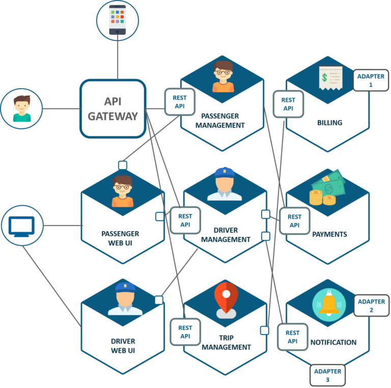
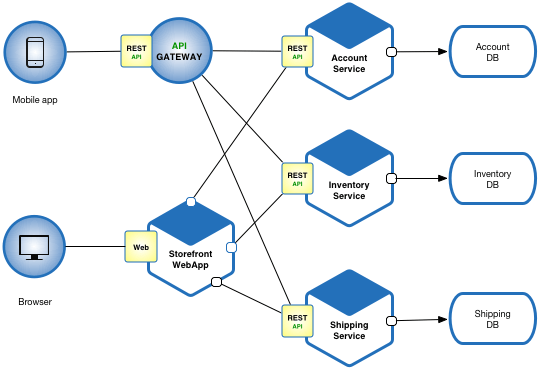
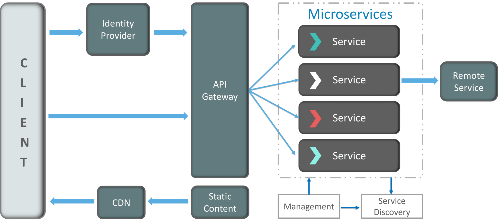
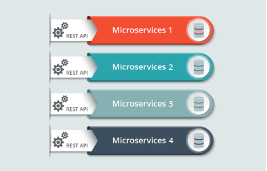
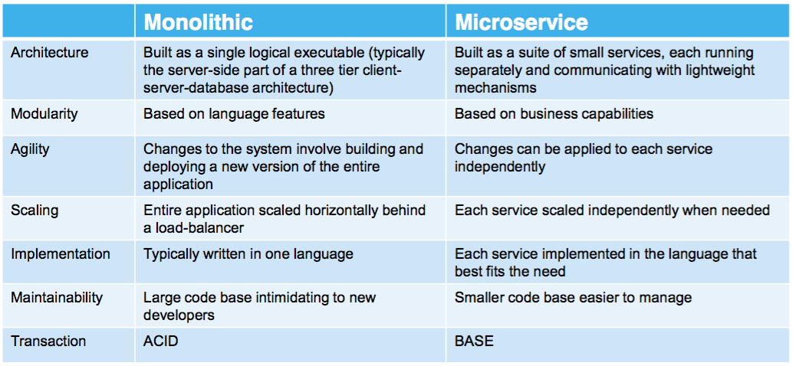

# Microservicios

El enfoque tradicional para el diseño de aplicaciones se ha centrado en la arquitectura monolítica, en esta todos los elementos de sus diferentes partes o módulos son desarrollados bajo una sola aplicación. Esto se traduce en una serie de desventajas claras, siendo especialmente importante que cuanto más grande es la aplicación, más difícil se vuelve resolver cada uno de los problemas que se generan e incluso la dificultad para añadir nueva funcionalidad rápidamente. 

Buscando soluciones a los problemas presentados se desarrolló una nueva forma de arquitectura, la basada en microservicios. Con esta se buscaba resolver los desafíos anteriores y además impulsar el desarrollo y la velocidad de respuesta en este.

## Arquitectura de microservicios:

### Definición

Actualmente no existe una definición clara de que son los microservicios, aunque podríamos decir que:

Una arquitectura de microservicios es un enfoque para desarrollar una aplicación software como una serie de pequeños servicios, cada uno ejecutándose de forma autónoma y comunicándose entre sí, por ejemplo, a través de peticiones HTTP a las API de cada microservicio. [Fuente](https://www.javiergarzas.com/2015/06/microservicios.html)

En las arquitecturas de microservicios, a diferencia del enfoque tradicional, los microservicios son elementos independientes que funcionan en conjunto para llevar a cabo las mismas tareas. En este enfoque, cada elemento o microservicio se encarga de una sola tarea, por tanto, el nivel de detalle, sencillez y capacidad para compartir procesos son elementos fundamentales en su desarrollo.

### Características: [Fuente](https://aws.amazon.com/es/microservices/)

- Autónomos: Cada servicio componente en una arquitectura de microservicios se puede desarrollar, implementar, operar y escalar sin afectar al funcionamiento de otros servicios. Además estos servicios no tienen, ni deben, compartir código alguno con el resto de servicios. Cualquier comunicación ocurre a través de las APIs.

- Especializados: Cada servicio está enfocado en resolver un problema y tiene sus capacidades propias. En el caso de que el módulo crezca, puede ser dividido en varios microservicios.

- Agilidad: Los microservicios propician una organización de equipos pequeños e independientes centrados en cada servicio. Por tanto, el contexto está mucho más acotado y comprendido, acortando los tiempos de los ciclos de desarrollo.

- Escalado flexible: Los microservicios permiten que cada servicio se escale de forma independiente para satisfacer la demanda. Esto permite adecuar las necesidades de la arquitectura en función de su uso.

- Implementación sencilla: Los microservicios permiten la integración y la entrega continuas. Esto facilita la actualización del código y acelera el tiempo de comercialización.

- Libertad tecnológica: En las arquitecturas de microservicios los equipos tienen libertad para elegir la mejor herramienta que resuelva cada problema específico.

- Código reutilizable: La división del software en pequeños módulos y bien definidos permite que dichos módulos puedan ser usados en otros contextos.

- Resistencia: La independencia del servicio aumenta la resistencia de una aplicación a los errores. En una arquitectura monolítica, un error puede provocar fallos en toda la aplicación. Con los microservicios, si hay un error en un servicio, las aplicaciones lo manejan degradando la funcionalidad sin bloquear toda la aplicación.

## Ejemplos:

Algunos diagramas de ejemplo de como sería una arquitectura basada en microservicios pueden ser los siguientes:

## Componentes:

Tomando como base la anterior imagen, la arquitectura basada en microservicios puede estar formada por los siguientes componentes: [Fuente](https://dzone.com/articles/microservice-architecture-learn-build-and-deploy-a)

- *Clients*: La arquitectura comienza con diferentes tipos de clientes, siendo estos dispositivos que intentan realizar diferentes usos de la aplicación.

- *Identity Providers*: Autentican a los clientes que realizan peticiones y comunican dichas consultas con la *API Gateway*.

- *API Gateway*: Los clientes no llaman a los servicios directamente, es la *API Gateway* la que actúa como punto de entrada para que los clientes envíen las solicitudes a los microservicios. Las ventajas de usar una *API Gateway* incluyen:
	- Todos los servicios pueden actualizarse sin que los clientes lo sepan.
	- Los servicios también pueden usar protocolos de mensajería que no son compatibles con la web.
	- La *API Gateway* puede realizar otras funciones transversales como proporcionar seguridad, equilibrio de carga, etc.

- *Messaging Formats*: Tenemos dos tipos de mensajes a través de los cuales se comunican:
	- Mensajes síncronos: en este los clientes esperan las respuestas del servicio. Los servicios suelen usar REST.
	- Mensajes asíncronos: en este caso los clientes no esperan las respuestas de los servicios, para ello se utilizan protocolos como AMQP, STOMP o MQTT.

- *Data Handling*: Cada microservicio posee una base de datos privada para capturar sus datos. Además, la base de datos de cada microservicio solo se actualiza a través de su API de servicio.

- *Static Content*: Después de que los microservicios se comuniquen entre si, implementan el contenido estático en un servicio de almacenamiento basado en la nube que puede entregarlos directamente a los clientes a través de *Content Delivery Networks* (CDN).

Además de estos componentes podemos encontrar otros dos que pueden aparecer en las arquitecturas típicas de microservicios.

- *Management*: Responsable de equilibrar los servicios en los nodos e identificar fallos.

- *Service Discovery*: Actúa como una guía entre microservicios para encontrar la ruta de comunicación entre ellos, ya que mantiene una lista de servicios en los que se encuentran los nodos.

## Arquitectura de microservicios vs Arquitectura monolítica:

## Ventajas y desventajas: [Fuente](https://docs.microsoft.com/es-es/dotnet/architecture/microservices/multi-container-microservice-net-applications/microservice-application-design)

### Ventajas

En una arquitectura basada en microservicios podemos encontrar ventajas como:

- Cada microservicio se puede diseñar, desarrollar e implementar independientemente de otros microservicios, lo que proporciona agilidad.

- Es fácil para los desarrolladores entender y trabajar con ellos, lo que aumenta la productividad.

- Es posible escalar horizontalmente áreas individuales de la aplicación. Una arquitectura de microservicios será mucho más eficaz con respecto a los recursos que se usan durante el escalado horizontal que una arquitectura monolítica.

- El trabajo de desarrollo se puede dividir en varios equipos, dedicando el esfuerzo de cada equipo a cada microservicio. Por tanto, cada equipo puede administrar, desarrollar, implementar y escalar su servicio de forma independiente.

- Los problemas son más aislados. Si se produce un problema en un servicio, inicialmente solo se ve afectado ese servicio (excepto cuando se usa un diseño incorrecto, con dependencias directas entre los microservicios) y los demás servicios pueden continuar con el control de las solicitudes.

- Se pueden usar las tecnologías más recientes.

### Desventajas

Aunque también podemos encontrar algunas desventajas:

- La distribución de la aplicación agrega complejidad para los desarrolladores cuando diseñen y creen servicios.

- Una aplicación con muchos microservicios y que necesita alta escalabilidad supone un alto grado de complejidad de implementación para las operaciones de TI y administración.

- Aumento de las necesidades de recursos globales.

- Problemas de comunicación directa de cliente a microservicio. Un problema podría ser un error de coincidencia potencial entre las necesidades del cliente y las API expuestas por cada uno de los microservicios.

- Difícil refactorizar los contratos para los microservicios. Con el tiempo, es posible que a los desarrolladores les interese cambiar la forma en que el sistema se divide en servicios. Pero si los clientes se comunican, realizar esta refactorización puede interrumpir la compatibilidad.

## Conclusión:

Como podemos ver, tanto las ventajas, desventajas y peculiaridades de las arquitecturas de microservicios hacen que construir un sistema bajo su filosofía sea tanto un desafío como un arte. 

Una vez expuestos todos los puntos podemos afirmar que las arquitecturas basadas en microservicios son tanto útiles como potentes, y que trabajando en una buena planificación, diseño y documentación las ventajas que nos proporcionan a largo plazo son innumerables.

También queda latente la necesidad de estas arquitecturas de una fuerte infraestructura y de una buena selección tanto de herramientas como recursos para que desde el primer momento, nos proporcionen el mejor resultado.

Es por todos estos puntos por lo que en el siguiente proyecto hemos decidido lanzarnos, y a la vez aprovechar, al desarrollo de un proyecto con una arquitectura basada en microservicios.

## Fuentes:

- [microservices](https://microservices.io/)

