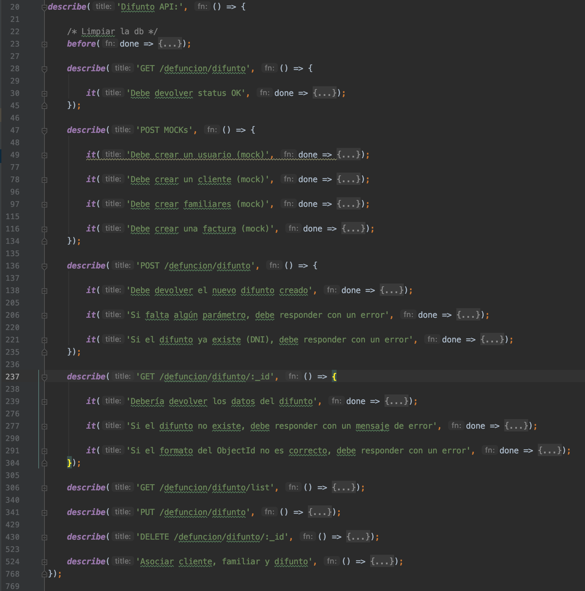
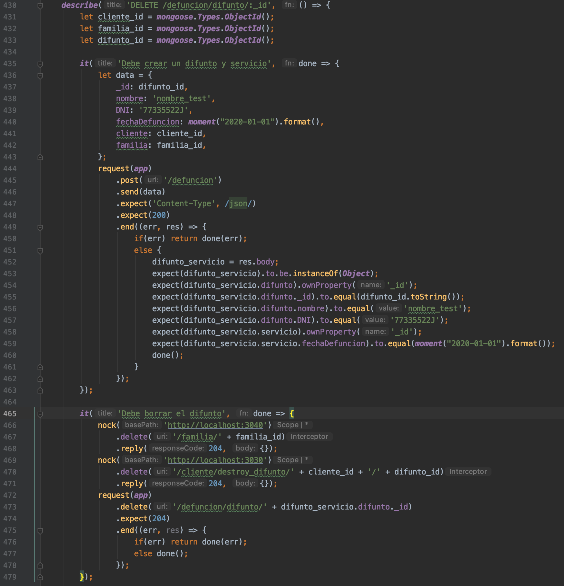
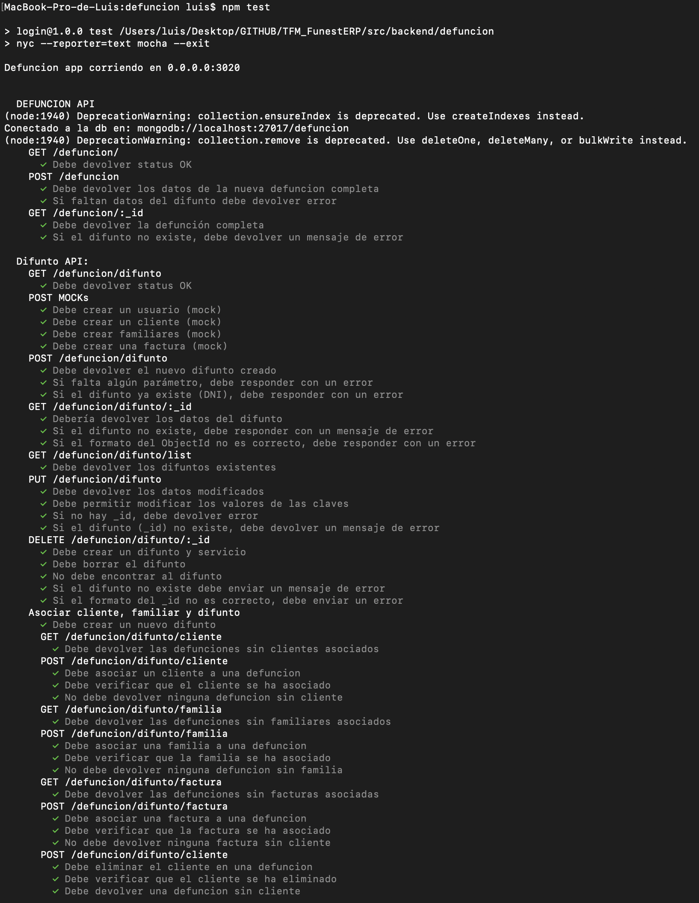
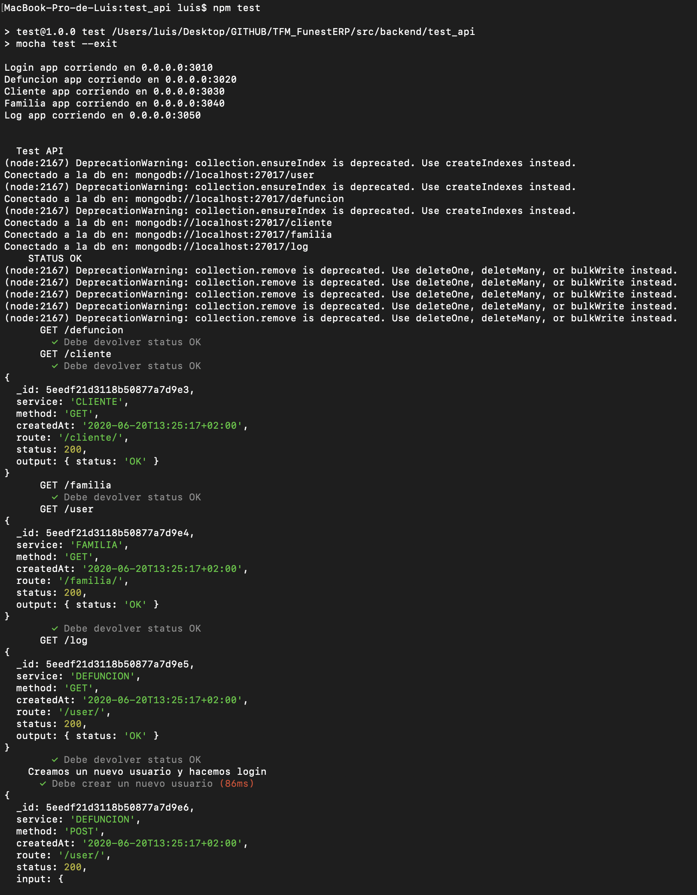

# Pruebas

Nuevo capítulo en el que mostraremos el intenso proceso de testeo del software seguido sobre el proyecto que nos ocupa. Punto esencial para verificar su correcto funcionamiento, hemos desarrollado tanto tests individuales por cada microservicio construido, como uno de integración para verificar el funcionamiento del sistema completo.

## Tests de los microservicios

A menudo, mientras estamos en el proceso de desarrollo de algún software, nos preguntamos si este funcionará como esperamos, si tendremos todos los posibles escenarios que el software debe satisfacer cubiertos, si con los nuevos cambios o funcionalidades estaremos rompiendo otras partes de este y muchas incógnitas más.

Es en este punto donde los *tests* entran en acción y son nuestro principal aliado. Incluso, en los últimos años se están llevando a cabo unas prácticas de desarrollo de software en las cuales los *tests* son el eje central de este y punto de partida de cada implementación.

En nuestro caso hemos hecho uso de estos desde dicha perspectiva, ya que además de buscar construir software robusto, buscábamos responder en cada microservicio la siguiente cuestión. ¿Qué escenarios debe cubrir el presente microservicio?. Partiendo desde tal incógnita desarrollábamos nuestros tests que, una vez cubiertos todos los escenarios imaginados y necesitados, nos permitían saber que cuando realizáramos la implementación del código correspondiente íbamos a tener tanto cubiertas todas las funcionalidades necesarias, como un software que trabaja acorde a lo planificado e ideado.

Esta es la base de los tests creados para cada microservicio, y que como puede verse en el código son especialmente extensos. Esto también se debe a que nuestro proyecto se centra en manejar datos, por lo que los tests buscan cubrir que en cada momento recibimos lo esperado y en el formato adecuado. A modo de ejemplo y de forma resumida podemos ver más abajo dos capturas del código. En la primera presentamos solo el nombre de cada test (para ejemplificar el grado de cobertura) y en la segunda mostramos un test en detalle.

Antes de finalizar este apartado queremos presentar de forma resumida las librerías que nos han acompañado en el desarrollo de cada microservicio:

- [Supertest](https://www.npmjs.com/package/supertest): Encargado de crear una abstracción a alto nivel para probar las diferentes peticiones HTTP. Por tanto nos permite enviar peticiones HTTP como GET, POST, PUT y DELETE a los servidores y obtener los resultados para verificar el funcionamiento.
- [Mocha](https://www.npmjs.com/package/mocha): Nos da la posibilidad de crear tanto tests síncronos como asíncronos de una forma sencilla, además nos proporciona muchas utilidades para la ejecución y el reporte de los tests. 
- [Chai](https://www.npmjs.com/package/chai): Librería de aserciones, nos proporciona varias interfaces para trabajar con la que te sientas más cómodo. En nuestro caso hemos hecho uso de *expect*.
- [Nock](https://www.npmjs.com/package/nock): Biblioteca para *mockear* las peticiones HTTP de los tests. Lo hemos enfocado para aquellas que se realizaban entre microservicios.

Por último y a modo de conclusión del apartado que nos ocupa, adjuntamos una captura de la ejecución de los tests para el microservicio defunción. Aunque estos son tan extensos que no he podido capturarlos al completo.

## Tests de la API

El motivo de la realización de este tipo de test ha venido propiciado principalmente por el hecho de no disponer de *frontend* todavía. En los últimos compases del desarrollo de este proyecto hemos tenido el miedo a que los diferentes microservicios no funcionaran correctamente entre sí una vez que desplegáramos estos en el *Cloud*. Quizás fuera un temor infundado pues los abundantes, detallados y completos tests unitario confirmaban que todo funcionaba según lo previsto.

Por tal razón nos adentramos en el desarrollo de estos tests de integración entre todos los microservicios. Estos no han sido tan exhaustivos y se han centrado en los principales casos de uso que un usuario haría de nuestro sistema. Añadir también que estos han sido hecho bajo las mismas librerías que en el caso anterior basándonos principalmente en la idea de que estos se ejecutaran también bajo *Travis*. De esta forma nos asegurábamos que nuestro sistema de integración continua cubría también los aspectos relativos a la integración completa de cada uno de los microservicios. Podemos ver un ejemplo de la ejecución de dichos tests desde la terminal más abajo.

Para concluir, comentar algunas curiosidades sobre la imagen anterior. Si nos fijamos en la primera parte de esta podemos ver como cada uno de los microservicios están siendo ejecutados además de cada una de las bases de datos conectadas. Posteriormente comienza el test y en este caso vemos en la terminal para cada tests realizado el *log* que se corresponde con dicha funcionalidad, ya que cada vez que se genera una nueva petición en cada uno de los microservicios, el log almacena la información pertinente.

